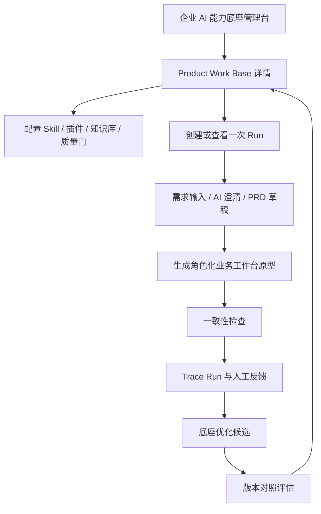
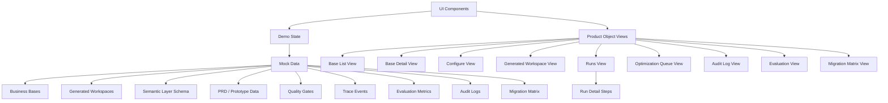
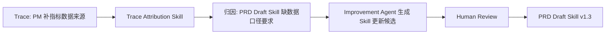

# 企业 AI 能力底座 Demo 实现说明

## 1. Demo 目标

这个 Demo 的目标不是做完整平台，而是做一个可讲、可截图、可交互的作品集样例。它要模拟的不是“PRD / 原型生成器”，而是一个**企业 AI 能力底座管理台**：企业可以在里面管理多个业务底座，每个底座都有自己的 Skill / 插件、知识库、质量门、运行记录、审计日志和优化闭环。

第一版用 **Product Work Base / 产品工作底座** 做样板间，并在这个底座下展示一个固定案例：生成“角色化业务工作台”。因此页面层级必须体现：

```text
企业 AI 能力底座
└─ Product Work Base / 产品工作底座
   ├─ 配置：Skill、插件、知识库、质量门
   ├─ 产物：角色化业务工作台
   ├─ 运行：一次从需求到 PRD / 原型 / 检查的 Run
   ├─ Trace：用户修改、采纳、驳回和评审反馈
   ├─ 优化：基于 Trace 生成底座升级候选
   └─ 审计：配置、知识库、Skill 和版本变更记录
```

需求拆解、PRD 生成、HTML 原型生成、一致性检查、Trace 回流和底座优化仍然是核心证明链，但它们不应该作为全局一级导航平铺展示，而应该作为 **Product Work Base 下某一次 Run 的详情**。

Demo 需要讲清楚七件事：

1. 产品工作流不是项目边界，而是企业多业务底座方法的第一版参考实现。
2. Demo 的真实产品对象是“底座 / 工作台 / Run / Trace / 资产版本”，不是一串并列流程页。
3. AI 不只是生成内容，而是在业务操作语义层、规则和质量门里工作。
4. 底座本身是一个 Harness，负责组织输入、上下文、Skill / Agent、工具、人工确认和 Trace。
5. 一致性检查是第一版的核心证据，用来证明它不是普通生成器。
6. Trace 不是普通埋点，而是把人工修改、采纳、驳回、评审和协同卡点转成可学习信号。
7. 底座更新后需要通过 V0 / V1 / V2 baseline 对照验证，证明它确实变好了。

第一版建议做静态交互 Demo。所有 AI 输出、Improvement Agent 输出和评估结果都可以用 mock 数据，不接真实模型、不做后端、不做登录权限。

最终作品集交付物建议拆成两层入口：

1. **Product Landing Page / 产品落地页**：面向招聘者或作品集读者，先讲清楚这个产品是什么、解决什么问题、为什么不是单点 AI 工具，并提供进入 Demo 的主按钮。
2. **Interactive Demo / 可交互 Demo**：点击落地页按钮后进入，第一屏直接打开企业 AI 能力底座管理台，不再重复做介绍型页面。

也就是说，落地页负责“吸引和解释”，Demo 负责“证明和操作”。两者视觉风格可以一致，但信息架构不能混在一起。

---

## 2. Demo 主线

使用一个固定业务案例贯穿全流程：

> 业务团队希望为不同岗位生成一个个性化业务工作台，让员工进入系统后能看到自己的待办事项、关键指标、常用功能入口、风险提醒和最近处理记录，减少在多个系统之间来回切换和漏处理任务。

Demo 的主线不是从 Input 开始，而是先进入底座管理台，再进入某个底座的运行和优化闭环：



其中 `需求输入 / AI 澄清 / PRD / 原型 / 一致性检查 / Trace` 是某一次 Run 的内部步骤，不是整个产品的一级页面。`底座优化建议` 和 `优化后评估` 在第一版里是 mock 出来的结果，用来展示系统设计和证据链，不声称已经实现真实 Agent 调度或真实实验评估。

---

## 3. 第一版页面清单

### 3.1 必做页面

| 页面 | 层级 | 作用 | 截图价值 |
| --- | --- | --- | --- |
| 产品落地页 | 作品集入口层 | 介绍 Enterprise AI Capability Base 的价值、方法和 Demo 入口 | 对外第一张截图 |
| 底座列表 / 总览页 | 全局产品层 | 展示企业里可以存在多个业务底座，Product Work Base 只是第一版样板间 | 主截图候选 |
| Product Work Base 详情页 | 底座层 | 展示该底座的版本、配置、知识库、最近 Run、质量状态和优化队列 | 主截图 |
| Configure 配置页 | 底座层 | 展示内置 Skill / 插件、用户知识库、质量门和个性化调优入口 | 证明它是可配置底座 |
| Generated Workspace 预览页 | 产物层 | 展示 Product Work Base 生成的角色化业务工作台，而不是只展示介绍页 | 证明产物是真工作台 |
| Runs 列表 / Run 详情页 | 运行层 | 展示一次从需求到 PRD、原型、检查和 Trace 的生成记录 | 证明流程可追溯 |
| PRD / Prototype 产物页 | Run 内部 | 展示结构化 PRD 和 HTML 原型之间的映射关系 | 核心产品截图 |
| 一致性检查页 | Run 内部 | 展示 PRD 与原型字段、状态、操作是否一致 | 证明质量门，不只是生成 |
| Trace / Audit 页 | Run / 底座层 | 展示修改、采纳、驳回、配置变更和可学习信号 | 证明底座会学习且可审计 |
| 底座优化页 | 底座层 | 展示如何从 Trace 生成 Skill、模板、规则或质量门的优化候选 | 证明闭环 |
| 评估 / 版本页 | 底座层 | 展示优化前后指标变化和 V0 / V1 / V2 baseline | 证明优化有效 |
| 多业务迁移矩阵页 | 作品集说明层 | 展示产品、市场、风控、PPT / 汇报生成如何复用同一框架 | 证明不是单点工具 |

### 3.2 可选页面

| 页面 | 说明 |
| --- | --- |
| 更细的 Product Work 业务操作语义层图 | 在时间充足时进一步解释 Demand、PRD、Page、Field、Action、QualityGate、Trace Run 的关系 |
| 跨节点协同页 | 展示产品 -> 研发、研发 -> 测试的结构化对齐包 |
| 第二个轻量底座详情页 | 只展示市场、风控或 PPT 底座的配置摘要，不做完整闭环 |

---

## 4. 推荐页面结构

### 4.1 产品信息架构总览

第一版交付物分成 `Landing Page` 和 `Interactive Demo` 两层。落地页是作品集入口，点击主按钮后进入 Demo App；Demo App 必须按下面这棵树实现，它是页面层级、导航结构和 mock 数据组织的基准：

```text
Product Landing Page / 产品落地页
└─ Launch Interactive Demo / 打开可交互 Demo
```

```text
Enterprise AI Capability Base
├─ Workspace Bases / 底座列表
│  ├─ Product Work Base
│  ├─ Market Work Base
│  ├─ Risk Work Base
│  └─ Report / PPT Base
│
├─ Product Work Base 详情
│  ├─ Overview / 当前状态
│  ├─ Configure / Skill、插件、知识库、质量门配置
│  ├─ Generated Workspaces / 已生成的工作台
│  ├─ Runs / 每次生成记录
│  ├─ Optimize / 反馈聚合与底座优化
│  └─ Audit Log / 配置、知识库、版本变更日志
│
└─ 某一次 Run 详情
   ├─ Input
   ├─ Clarify
   ├─ PRD
   ├─ Prototype
   ├─ Quality Check
   └─ Trace
```

这里有三个层级不能混在一起：

1. `Product Landing Page` 是作品集入口层，用来解释价值和引导进入 Demo。
2. `Workspace Bases` 是企业层，用来证明这是多业务底座，不是单点产品工具。
3. `Product Work Base 详情` 是样板间层，用来展示一个底座如何配置、生成、运行、优化和审计。
4. `某一次 Run 详情` 是证明链层，用来展示一次从需求到 PRD、原型、检查和 Trace 的过程。

实现时，`Input / Clarify / PRD / Prototype / Quality Check / Trace` 只能出现在 Run 详情内部，不能出现在全局一级导航里。

### 4.2 页面布局

建议使用单页应用结构：

- 左侧：全局产品导航，代表真实产品对象，而不是证明流程步骤。
- 中间：当前底座、工作台、Run 或资产的主内容。
- 右侧：随当前页面变化的配置 / Trace / Quality Gate / 版本辅助栏。

这样可以让读者一直看到“我正在管理哪个底座、哪个产物、哪一次运行，以及这些行为如何回流到底座”。

### 4.3 全局一级导航

```text
Workspace Bases
Skill Library
Knowledge Sources
Generated Workspaces
Runs
Optimization Queue
Evaluation
Audit Logs
```

一级导航必须代表产品对象和管理能力，不要把 `Input / Clarify / PRD / Prototype / Check / Trace` 做成全局一级导航。

### 4.4 Product Work Base 内部标签页

进入 `Product Work Base` 后，建议使用底座详情页内的二级标签：

```text
Overview
Configure
Generated Workspace
Runs
Optimize
Audit Log
```

其中：

- `Overview` 展示底座状态、版本、近期运行、质量风险和优化队列摘要。
- `Configure` 展示内置 Skill / 插件、用户知识库、业务规则、质量门和个性化调优配置。
- `Generated Workspace` 展示这个底座生成出来的角色化业务工作台。
- `Runs` 展示每次生成记录，点击后进入 Run 详情。
- `Optimize` 展示 Trace 聚合后的底座升级候选。
- `Audit Log` 展示 Skill、知识库、规则、质量门和版本的变更记录。

### 4.5 Run 详情内部步骤

旧版本里的线性流程应该收进 Run 详情：

```text
Input
Clarify
PRD
Prototype
Quality Check
Trace
Evaluation Snapshot
```

这些步骤用于证明某一次运行如何从模糊需求走到可检查、可回流的产物，但它们不是整个产品的信息架构。

第一版不一定做真实路由。可以用前端 state 切换全局导航、底座标签页和 Run 内部步骤。

### 4.6 UI 风格参考：Stackbirds 风格转译

参考项目：

```text
AI Agents Platform - Stackbirds | UI/UX Design
https://www.behance.net/gallery/245628807/AI-Agents-Platform-Stackbirds-UIUX-Design
```

第一版 Demo 可以参考 Stackbirds 的视觉气质，但不能照搬成营销展示页。这里要转译成一个真实可操作的企业 AI 底座管理台。

风格关键词：

```text
Ice-blue enterprise AI console
Soft glass panels
Calm futuristic SaaS
Thin flow lines
Large pale background typography
Dark analytical sections
```

#### 可借鉴的视觉语言

| 维度 | Stackbirds 的启发 | 在本 Demo 中的转译 |
| --- | --- | --- |
| 整体气质 | 浅冰蓝背景、干净留白、轻未来感 | 用浅蓝灰背景承载企业管理台，保持克制、清晰、专业 |
| 产品界面 | 白色玻璃感面板、细边框、轻阴影 | 用于底座详情、配置、Run、Trace、质量门等操作面板 |
| 流程表达 | 细线、节点、roadmap、agent setup flow | 用于 Base -> Workspace -> Run -> Trace -> Optimize 的关系图 |
| 大字背景 | 极浅的大标题作为空间氛围 | 只用于作品集封面、空状态或章节背景，不影响操作信息密度 |
| 深色段落 | 黑蓝背景承载分析、roadmap、flow | 用于 Trace / Audit、Optimization、Evaluation 等“证据链”页面 |
| AI 感 | 柔和光感、轻量渐变、agent 语义 | 通过状态光、细边框、流线和微动效体现，不使用夸张装饰 |

#### 推荐设计 tokens

```text
Background:      #F4F8FF / #EEF5FF
Panel:           rgba(255, 255, 255, 0.86)
Panel strong:    #FFFFFF
Border:          #DCE7F6
Text primary:    #08142F
Text secondary:  #5F6F8C
Text muted:      #8A96AD
Accent blue:     #4A8DFF
Accent cyan:     #65D6FF
Accent green:    #65C98F
Dark section:    #070B14 / #0B1220
Warning:         #F5A524
Danger:          #E95F6A
Radius:          12px for panels, 8px for compact controls
Shadow:          soft blue-gray shadow, low opacity
```

#### 页面层级里的具体用法

| 页面 | 风格用法 |
| --- | --- |
| 产品落地页 | 最接近 Stackbirds 的展示气质：大标题、产品 mockup、轻量价值说明和明确 Demo 入口 |
| 底座列表 / 总览页 | 浅冰蓝背景 + 白色底座卡片 + 轻量状态标签，突出多个业务底座并列存在 |
| Product Work Base 详情页 | 更像企业 SaaS dashboard，信息密度要高于 Behance 展示图 |
| Configure 配置页 | 使用玻璃感配置面板、开关、pill tags、版本 badge，突出可配置性 |
| Generated Workspace 预览页 | 可以使用 device / browser frame 的展示方式，但里面必须是真工作台界面 |
| Runs / Run 详情页 | 用细线 stepper 和对象关系线表达一次运行，不使用全局步骤导航 |
| Trace / Audit 页 | 可以使用深色分析区，承载 timeline、事件、归因和审计记录 |
| Optimize / Evaluation 页 | 使用深色或半深色证据链页面，突出优化候选、版本 diff 和 baseline 对比 |
| 多业务迁移矩阵页 | 保持浅色信息图风格，用细线和矩阵说明多底座共性 |

#### 必须避免

- 不要把 Demo App 做成纯作品集 landing page；落地页可以介绍产品，但点击进入 Demo 后第一屏必须是可操作的底座管理台。
- 不要让大标题、背景字或氛围图压过核心信息。
- 不要把 `Input / Clarify / PRD / Prototype / Check / Trace` 做成全局一级导航。
- 不要只展示平板、屏幕 mockup，而不展示真实可点击的管理台界面。
- 不要使用低对比度浅灰文字承载关键信息。
- 不要用夸张的发光球、渐变光斑或纯装饰图形作为主要背景。
- 不要为了“AI 感”牺牲企业工具的可读性、状态表达和信息密度。

一句话设计方向：

> 用 Stackbirds 的冰蓝、轻盈、未来感，包装一个真实的企业 AI 底座管理台；视觉上像高质量 AI SaaS，结构上必须像可配置、可审计、可优化的工作系统。

---

## 5. 技术实现建议

### 5.1 技术栈

推荐任选一种轻量前端方案：

| 方案 | 适合情况 |
| --- | --- |
| Vite + React + TypeScript | 最快搭交互 Demo |
| Next.js + React | 后续想做作品集页面和部署 |
| 纯 HTML / CSS / JS | 最轻，但组件复用较弱 |

建议第一版用：

```text
Vite + React + TypeScript + Tailwind CSS
```

如果项目已经有现成前端框架，就沿用现有框架。

### 5.2 数据方式

第一版全部使用本地 mock 数据：

```text
src/data/demoRun.ts
src/data/bases.ts
src/data/workspaceArtifacts.ts
src/data/auditLogs.ts
src/data/semanticLayer.ts
src/data/prd.ts
src/data/prototype.ts
src/data/skills.ts
src/data/qualityGates.ts
src/data/trace.ts
src/data/evaluation.ts
src/data/migration.ts
```

不接真实 LLM，不做数据库。这样可以先把叙事、结构和截图质量做出来。

### 5.3 架构分层



---

## 6. 核心数据模型

### 6.1 业务操作语义层 Schema

第一版只需要轻量对象模型，不需要真的做知识图谱数据库。这里的“业务操作语义层”包含 Domain Ontology，但不止是对象和关系；它还要定义 AI 可以执行哪些动作、哪些规则必须检查、哪些 Trace 可以回流到哪些资产。

```ts
type SemanticEntity =
  | "Demand"
  | "Clarification"
  | "PRD"
  | "Prototype"
  | "Page"
  | "Component"
  | "Field"
  | "BusinessRule"
  | "QualityGate"
  | "ReviewComment"
  | "TraceRun"
  | "Skill"
  | "Template"
  | "KnowledgeAsset";
```

核心关系：

```ts
type SemanticLink = {
  source: SemanticEntity;
  target: SemanticEntity;
  relation: string;
};
```

示例关系：

```ts
[
  { source: "Demand", target: "Clarification", relation: "generates" },
  { source: "Clarification", target: "PRD", relation: "feeds" },
  { source: "PRD", target: "Prototype", relation: "maps_to" },
  { source: "Page", target: "Component", relation: "contains" },
  { source: "Component", target: "Field", relation: "contains" },
  { source: "TraceRun", target: "Skill", relation: "uses" }
]
```

可执行动作：

```ts
type SemanticAction = {
  id: string;
  name: string;
  inputEntities: SemanticEntity[];
  outputEntities: SemanticEntity[];
  skillId: string;
  guardrails: string[];
  humanCheckpoint?: string;
};
```

示例：

```ts
const generatePrototypeAction: SemanticAction = {
  id: "action-generate-prototype",
  name: "Generate HTML prototype structure from PRD",
  inputEntities: ["PRD", "BusinessRule", "Template"],
  outputEntities: ["Prototype", "Page", "Component", "Field"],
  skillId: "skill-prototype-mapping",
  guardrails: [
    "Do not create operations that are not described in PRD",
    "Mark uncertain page states as needs confirmation"
  ],
  humanCheckpoint: "PM confirms prototype scope before consistency check"
};
```

业务规则与质量门：

```ts
type BusinessRule = {
  id: string;
  title: string;
  appliesTo: SemanticEntity[];
  severity: "low" | "medium" | "high";
  sourceAssetId: string;
};

type QualityGate = {
  id: string;
  name: string;
  checks: string[];
  blocksProgress: boolean;
};
```

示例：

```ts
const workspaceDataGate: QualityGate = {
  id: "gate-workspace-data-coverage",
  name: "Workspace data source and state coverage",
  checks: [
    "workspace widgets include data source and refresh frequency",
    "todo and risk modules include default/loading/empty/error/no_permission states",
    "prototype operations are defined in PRD"
  ],
  blocksProgress: false
};
```

Trace 绑定：

```ts
type TraceBinding = {
  eventType: TraceEvent["eventType"];
  bindsTo: SemanticEntity[];
  possibleImprovementTargets: Array<
    "Context" | "Template" | "Rule" | "Skill" | "SemanticLayer" | "Harness"
  >;
};
```

### 6.2 Base / Workspace 数据

```ts
type BusinessBase = {
  id: string;
  name: string;
  version: string;
  businessDomain: "product" | "market" | "risk" | "reporting";
  status: "draft" | "active" | "optimizing" | "archived";
  owner: string;
  builtInSkills: string[];
  customPlugins: string[];
  knowledgeSources: string[];
  qualityGateIds: string[];
  activeWorkspaceIds: string[];
  recentRunIds: string[];
  optimizationCandidateIds: string[];
  lastOptimizedAt?: string;
};
```

示例：

```ts
const productWorkBase: BusinessBase = {
  id: "base-product-work",
  name: "Product Work Base",
  version: "v1.0",
  businessDomain: "product",
  status: "active",
  owner: "Product Ops",
  builtInSkills: [
    "skill-demand-clarification",
    "skill-prd-draft",
    "skill-prototype-mapping",
    "skill-consistency-check",
    "skill-trace-attribution"
  ],
  customPlugins: ["plugin-workspace-widget-library"],
  knowledgeSources: [
    "workspace-prd-examples",
    "role-permission-rules",
    "metric-glossary",
    "page-state-guidelines"
  ],
  qualityGateIds: [
    "gate-workspace-data-coverage",
    "gate-role-permission-coverage",
    "gate-prd-prototype-consistency"
  ],
  activeWorkspaceIds: ["workspace-role-based-business"],
  recentRunIds: ["run-role-workspace-001"],
  optimizationCandidateIds: ["opt-prd-data-source-section"],
  lastOptimizedAt: "2026-07-04"
};
```

```ts
type WorkspaceArtifact = {
  id: string;
  baseId: string;
  name: string;
  artifactType: "role_workspace" | "prd" | "prototype" | "report";
  generatedByRunId: string;
  pages: string[];
  configuredRoles: string[];
  linkedSkills: string[];
  linkedKnowledgeSources: string[];
  auditLogIds: string[];
};
```

```ts
type AuditLogEntry = {
  id: string;
  baseId: string;
  targetType: "Skill" | "KnowledgeAsset" | "QualityGate" | "Template" | "Workspace" | "Run";
  targetId: string;
  action: "created" | "updated" | "approved" | "rejected" | "version_released";
  actor: "system" | "pm" | "admin" | "agent";
  timestamp: string;
  summary: string;
  linkedTraceIds?: string[];
};
```

### 6.3 Demo Run

```ts
type DemoRun = {
  runId: string;
  baseId: string;
  workspaceArtifactId?: string;
  title: string;
  businessLine: string;
  demandType: string;
  currentStep: string;
  usedAssets: string[];
  status: "draft" | "reviewing" | "improving" | "evaluated";
};
```

### 6.4 PRD 数据

```ts
type PRDSection = {
  id: string;
  title: string;
  content: string;
  status: "generated" | "edited" | "confirmed" | "needs_confirmation";
  linkedObjects: string[];
};
```

### 6.5 原型数据

```ts
type PrototypePage = {
  id: string;
  name: string;
  states: Array<"default" | "loading" | "empty" | "error" | "no_permission">;
  components: string[];
  linkedPrdSections: string[];
};
```

### 6.6 Trace Event

Trace 不应该依赖用户写长反馈。第一版可以按三类捕获：

| Trace 类型 | 捕获方式 | 示例 |
| --- | --- | --- |
| 系统自动捕获 | 输入、输出、质量门、编辑 diff、重生成次数 | 原型出现“团队排行榜”，但 PRD 没有定义数据来源和可见范围 |
| 用户轻量确认 | 采纳 / 驳回、修改原因标签、是否待确认 | PM 选择“AI 越界假设”“模板缺状态” |
| 关键节点追问 | 是否进入评审、是否值得沉淀为资产 | 提交前询问“风险提醒卡片是否可沉淀为通用组件候选” |

```ts
type TraceEvent = {
  traceId: string;
  runId: string;
  timestamp: string;
  step: string;
  eventType:
    | "input_submitted"
    | "context_retrieved"
    | "skill_executed"
    | "output_generated"
    | "quality_gate_triggered"
    | "human_edit"
    | "suggestion_adopted"
    | "suggestion_rejected"
    | "regeneration_requested"
    | "review_result_updated"
    | "asset_candidate_created";
  objectType: SemanticEntity;
  objectId: string;
  actor: "system" | "pm" | "agent" | "reviewer";
  captureMode: "auto" | "user_confirmed" | "checkpoint_question";
  assetVersion?: string;
  before?: string;
  after?: string;
  feedbackTag?:
    | "missing_context"
    | "template_gap"
    | "rule_gap"
    | "field_naming"
    | "state_missing"
    | "ai_overreach"
    | "prototype_prd_mismatch";
  humanReason?: string;
  confidence?: number;
  improvementTarget?: "Context" | "Template" | "Rule" | "Skill" | "SemanticLayer" | "Harness";
};
```

### 6.7 Evaluation Metric

```ts
type EvaluationVariant = "V0_general_ai" | "V1_product_base" | "V2_trace_optimized_base";

type EvaluationMetric = {
  name: string;
  category: "Quality" | "Efficiency" | "Trace" | "Asset" | "Business";
  values: Record<EvaluationVariant, number>;
  unit: string;
  direction: "up_is_good" | "down_is_good";
  note?: string;
};
```

版本含义：

| 版本 | 含义 | 证明点 |
| --- | --- | --- |
| V0_general_ai | 通用 AI 直接根据一句话需求生成 PRD / 原型 | 单点生成容易遗漏业务规则、状态和上下文 |
| V1_product_base | 接入产品工作底座：知识库、模板、业务操作语义层、Harness、质量门 | 底座让产物更结构化、更可检查 |
| V2_trace_optimized_base | 基于 Trace 更新模板、规则、Skill 或质量门后的版本 | 底座能减少同类问题复发 |

Demo 中的评估数字是 illustrative mock，用来展示评估方法和作品集叙事，不应表述成真实线上实验结果。

---

## 7. 预置 Skills 与 Skill 优化

第一版 Demo 可以预置几个和产品工作底座相关的 Skill。这样用户更容易理解“底座优化”不是抽象口号，而是具体资产的版本升级。

### 7.1 预置 Skills

| Skill | 版本 | 作用 |
| --- | --- | --- |
| Demand Clarification Skill | v1.1 | 从一句话需求生成澄清问题，覆盖价值、范围、角色、规则、验收和风险 |
| PRD Draft Skill | v1.2 | 基于澄清单、历史 PRD、模板和业务规则生成 PRD 草稿 |
| Prototype Mapping Skill | v1.0 | 从 PRD 中识别页面、组件、字段和状态，并生成原型结构 |
| Consistency Check Skill | v1.0 | 检查 PRD 与原型之间的页面、字段、状态、操作和验收标准是否一致 |
| Trace Attribution Skill | v0.9 | 将人工修改、采纳、驳回和评审意见归因到模板、规则、Skill、业务操作语义层或 Context |

### 7.2 Skill 数据模型

```ts
type SkillAsset = {
  id: string;
  name: string;
  version: string;
  purpose: string;
  inputs: string[];
  outputs: string[];
  knownIssues: string[];
  improvementCandidates: string[];
};
```

示例：

```ts
const prdDraftSkill: SkillAsset = {
  id: "skill-prd-draft",
  name: "PRD Draft Skill",
  version: "v1.2",
  purpose: "Generate structured PRD drafts from clarification notes and business context.",
  inputs: ["Clarification", "BusinessRule", "Template", "KnowledgeAsset"],
  outputs: ["PRD", "Risk", "Acceptance", "Todo"],
  knownIssues: [
    "Often misses no-permission state in workflow pages",
    "Sometimes assumes ranking widgets without explicit evidence"
  ],
  improvementCandidates: [
    "Add required page-state checklist",
    "Strengthen guardrail for unsupported solution assumptions"
  ]
};
```

### 7.3 Skill 优化链路

第一版不实现真正的 Agent 调度。页面里展示的是一个 mock 的 Improvement Agent 输出：它基于预置 Trace 聚合结果，生成“看起来像系统建议”的优化候选，用来说明闭环设计。



### 7.4 Demo 中建议展示的 Skill 更新

| Trace 发现 | 影响的 Skill | 更新内容 | 新版本 |
| --- | --- | --- | --- |
| 工作台类需求频繁补指标数据来源 | PRD Draft Skill | 增加“数据来源 / 刷新频率”必填章节 | v1.3 |
| 原型经常漏空 / 错 / 加载状态 | Prototype Mapping Skill | 默认生成关键模块状态 | v1.1 |
| AI 自动假设团队排行榜 | PRD Draft Skill | 增加“未经证据不得假设模块”规则 | v1.3 |
| 指标命名被反复修改 | Consistency Check Skill | 增加指标术语表校验 | v1.1 |

页面上可以展示一个简单的版本 diff：

```text
PRD Draft Skill v1.2 -> v1.3

+ Add required "Data Source and Refresh Frequency" section
+ Require data source and refresh frequency for dashboard metrics
+ Mark unsupported solution assumptions as "Needs confirmation"
```

---

## 8. 页面内容细节

### 8.1 产品落地页

作用：

- 作为作品集入口页，让招聘者先理解这个产品是什么。
- 用 30 秒讲清楚主张：企业不应该只堆单点 AI 工具，而应该建立可配置、可审计、可优化的业务 AI 底座。
- 提供一个明确按钮进入可交互 Demo。

页面结构建议：

| 区块 | 内容 | 目的 |
| --- | --- | --- |
| Hero | `Enterprise AI Capability Base` + 一句话价值主张 + `Launch Interactive Demo` 按钮 | 让读者快速知道项目主题并进入 Demo |
| Product Preview | 展示底座管理台的浏览器框 / 屏幕 mockup | 让读者看到这不是概念图，而是可操作产品 |
| Why It Matters | 少返工、少漏项、少重复搭建三层价值 | 解释商业价值 |
| How It Works | Base -> Workspace -> Run -> Trace -> Optimize -> Version | 解释产品机制 |
| Reference Implementation | Product Work Base 生成角色化业务工作台 | 说明第一版样板间 |
| Proof Points | 配置、质量门、Trace、优化、Baseline | 引导读者点击 Demo 后看什么 |
| Transfer Matrix Preview | 产品、市场、风控、PPT / 汇报生成的共性机制 | 防止被误解成单点工具 |

主按钮：

```text
Launch Interactive Demo
```

点击后进入 Demo App 的 `Workspace Bases / 底座列表` 或直接进入 `Product Work Base Overview`。如果想强调多业务底座，优先进入 `Workspace Bases`；如果想让读者更快看到核心案例，可以进入 `Product Work Base Overview`，但页面上仍要保留返回底座列表的入口。

落地页可以更接近 Stackbirds 的作品集展示风格：大字背景、产品 mockup、轻量解释、冰蓝视觉。但点击进入 Demo 后，界面必须回到可操作管理台，不再继续做营销式长页。

### 8.2 底座列表 / 总览页

展示：

- 企业里已有或可创建的业务底座列表。
- 每个底座的业务域、版本、状态、最近运行次数、待处理优化候选和质量风险。
- Product Work Base 作为第一版参考实现，状态为 active。
- Market Intelligence Base、Risk Monitoring Base、Report / PPT Base 可以作为 mock 底座展示，但不做完整闭环。

交互：

- 点击 `Product Work Base` 进入底座详情。
- 点击其他底座只展示摘要或迁移说明，避免第一版范围膨胀。

这页要让读者在 10 秒内明白：产品工作底座不是整个项目边界，而是企业多业务底座中的一个样板间。

### 8.3 Product Work Base 详情页

展示：

- 底座名称：Product Work Base v1.0。
- 当前案例：角色化业务工作台生成。
- 底座健康状态：质量门通过率、Trace 数、待审核优化候选、最近版本更新时间。
- 已配置资产：内置 Skill、用户知识库、模板、业务规则、质量门。
- 最近 Runs：角色化业务工作台生成、PRD 更新、原型一致性检查。
- 当前生成产物：Role-based Business Workspace。

右侧辅助栏展示：

- 当前底座 proof point。
- Active Skills。
- Knowledge Sources。
- Quality Gates。
- Open Optimization Candidates。

交互：

- 切换 `Overview / Configure / Generated Workspace / Runs / Optimize / Audit Log`。
- 点击最近 Run 进入 Run 详情。
- 点击优化候选进入底座优化页。

### 8.4 Configure 配置页

展示：

- 内置 Skill：Demand Clarification、PRD Draft、Prototype Mapping、Consistency Check、Trace Attribution。
- 用户可扩展插件：Workspace Widget Library、Role Permission Mapper、Metric Glossary Checker。
- 知识库来源：历史 PRD、页面规范、角色权限规则、指标口径表、组件规范。
- 质量门：数据来源覆盖、权限边界、状态覆盖、PRD / 原型一致性、AI 越界假设检查。
- 个性化调优入口：导入知识库、启用 / 停用 Skill、调整质量门严格度。

交互：

- 勾选 Skill 或插件启用状态。
- 查看某个 Skill 的输入、输出、版本和已知问题。
- 点击知识库项查看它被哪些 Runs 使用。
- 点击质量门查看检查项和最近触发记录。

这页是“底座可配置”的核心证据，不能只做成介绍文字。

### 8.5 Generated Workspace 预览页

展示 Product Work Base 生成出来的真实工作台产物：

- 个人工作台首页。
- 角色化模块配置页。
- 待办详情抽屉。
- 风险提醒列表页。
- 快捷入口管理页。

工作台首页建议包含：

- 待办事项。
- 关键指标。
- 常用功能入口。
- 风险提醒。
- 最近处理记录。
- 角色 / 权限视图切换。

状态切换：

- 默认。
- 加载。
- 空状态。
- 异常。
- 无权限。

右侧辅助栏展示：

- 该工作台由哪个 Run 生成。
- 对应 PRD 章节。
- 使用了哪些 Skill / Template / Knowledge Sources。
- 当前有哪些 Trace 和质量问题。

第一版可以直接用 React 组件模拟页面，不必真的 iframe 加载独立 HTML。

### 8.6 Runs 列表 / Run 详情页

Runs 列表展示：

- Run 标题。
- 业务线。
- 触发人。
- 使用的底座版本。
- 当前状态。
- 生成产物。
- 质量门结果。
- Trace 数量。

点击 Run 后进入详情页。Run 详情内部使用二级步骤：

```text
Input
Clarify
PRD
Prototype
Quality Check
Trace
Evaluation Snapshot
```

这组步骤用于讲清楚“某一次生成是怎么发生的”，但不作为全局一级导航。

### 8.7 Run 内部：需求输入与 AI 澄清

需求输入展示：

- 需求标题。
- 一句话描述。
- 业务线。
- 需求类型。
- 背景材料。
- 历史 PRD / 页面规范 / 业务规则。

核心信息：

```text
业务团队希望为不同岗位生成一个个性化业务工作台，让员工进入系统后能看到自己的待办事项、关键指标、常用功能入口、风险提醒和最近处理记录，减少在多个系统之间来回切换和漏处理任务。
```

AI 澄清展示分类：

- Value：为什么要做。
- Scope：做什么 / 不做什么。
- Role：涉及哪些角色。
- Rule：模块权限、数据来源和提醒规则是什么。
- Acceptance：怎么验收。
- Risk：有什么风险。

### 8.8 Run 内部：PRD 草稿页

展示章节：

- 背景与目标。
- 用户角色。
- 业务流程。
- 功能需求。
- 页面说明。
- 字段规则。
- 权限规则。
- 异常状态。
- 验收标准。
- 风险与待确认项。

右侧辅助栏展示：

- 关联业务操作语义层对象。
- 使用的 Skill / Template。
- 当前质量门状态。
- 人工编辑是否已经写入 Trace。

### 8.9 Run 内部：HTML 原型与一致性检查

HTML 原型展示：

- 页面列表。
- 状态切换。
- 当前页面对应的 PRD 段落。
- 页面组件、字段、操作和权限说明。

一致性检查展示：

| 问题 | 严重程度 | 建议 |
| --- | --- | --- |
| PRD 提到风险提醒，原型缺少风险提醒模块入口 | High | 在工作台首页增加风险提醒卡片 |
| 原型出现团队排行榜，但 PRD 未定义数据来源和可见范围 | Medium | 补充排行榜数据口径、权限和适用角色 |
| 指标卡片缺少刷新时间和数据延迟说明 | Medium | 在指标卡增加刷新时间和异常提示 |
| 待办列表缺少空状态、加载失败状态和无权限状态 | High | 增加待办模块的完整状态覆盖 |

### 8.10 Trace / Audit 页

Trace Run 展示事件时间线：

```text
Input Submitted
Skill Executed
Output Generated
Quality Gate Triggered
Human Edit
Suggestion Adopted
Asset Candidate Created
```

重点展示：

- PM 补充了“指标数据来源和刷新频率”。
- PM 调整了“待办优先级”和“快捷入口排序”。
- PM 驳回了 AI 自动假设的“团队排行榜”。
- 系统将这些行为标记为 Trace。

Audit Log 展示底座资产变更：

- 谁更新了哪个 Skill。
- 哪个知识库被导入或停用。
- 哪条质量门被调整。
- 哪个优化候选被人工审核通过。
- Product Work Base 从 v1.0 到 v1.1 的版本记录。

Trace 偏向“用户使用中的可学习信号”，Audit 偏向“底座资产和配置变更的责任记录”。两者可以在同一页用 tab 区分，也可以拆成两个页面。

### 8.11 底座优化页

展示从 Trace 到优化建议：

| Trace 发现 | 归因 | 优化建议 | 影响资产 |
| --- | --- | --- | --- |
| 多个工作台需求都补指标数据来源 | PRD Draft Skill 缺数据口径要求 | 更新 PRD Draft Skill | Skill |
| 原型经常漏空 / 错 / 加载状态 | Prototype Mapping Skill 状态映射不足 | 更新 Prototype Mapping Skill | Skill |
| 待办优先级反复被调整 | 澄清 Skill 没问清角色目标和排序规则 | 更新澄清问题模板和 Consistency Check Skill | Skill / Knowledge |
| 团队排行榜建议被驳回 | AI 越界做模块假设 | 更新 PRD Draft Skill Guardrail | Skill / Harness |

新增一个 Skill 优化卡片：

```text
PRD Draft Skill v1.2 -> v1.3

Trigger:
- 62% workspace PRDs manually added metric data source and refresh frequency
- 4 review comments mentioned unclear widget priority or missing data ownership

Update:
- Add required Data Source and Refresh Frequency section
- Require role visibility and state coverage for workspace widgets
- Mark unsupported solution assumptions as Needs confirmation
```

强调：

- Agent 只提出优化候选。
- 人负责审核是否进入底座。
- 底座更新需要版本记录，包括 Skill、模板、规则、Harness 和业务操作语义层。

### 8.12 评估 / 版本页

展示 V0 / V1 / V2 baseline 对照。数字可以用 mock，但页面上要明确这是“评估方法示例”，不是线上真实实验结论。

| 指标 | V0 通用 AI | V1 产品工作底座 | V2 Trace 优化后 | 方向 |
| --- | --- | --- | --- | --- |
| 首稿采纳率 | 42% | 58% | 72% | 上升 |
| 人工编辑率 | 51% | 38% | 24% | 下降 |
| 异常状态补充次数 | 18 | 12 | 4 | 下降 |
| PRD / 原型不一致数 | 9 | 5 | 2 | 下降 |
| 原型一次评审通过率 | 31% | 46% | 68% | 上升 |
| 同类问题复发率 | 44% | 31% | 12% | 下降 |

解释口径：

- V0 证明通用 AI 直接生成会漏规则、漏状态、漏上下文。
- V1 证明加入知识库、模板、业务操作语义层、Harness 和质量门后，产物更稳定。
- V2 证明根据 Trace 更新模板、规则或 Skill 后，同类问题开始下降。

### 8.13 多业务迁移矩阵页

展示产品工作流不是项目边界，而是第一版参考实现。

| 共通机制 | 产品工作底座 | 市场情报底座 | 风控监控底座 | PPT / 汇报生成底座 |
| --- | --- | --- | --- | --- |
| 原始输入 | 一句话需求、背景材料、历史 PRD | 竞品动态、渠道数据、营销素材 | 页面、交易、规则、异常记录 | 汇报主题、业务数据、参考材料 |
| 知识库 | 历史 PRD、页面规范、业务规则 | 竞品库、品牌策略、历史 campaign | 风控规则、历史案例、阈值策略 | 历史 deck、品牌规范、图表模板 |
| Skill | 需求拆解、PRD、原型生成 | 情报摘要、趋势分析、策略建议 | 异常识别、风险分级、报告生成 | 大纲生成、页面生成、讲稿生成 |
| 业务操作语义层 | Demand、PRD、Prototype、Page、Field | Competitor、Channel、Campaign、Insight | Risk Event、Rule、Alert、Case | Topic、Slide、Chart、Narrative |
| 质量门 | PRD / 原型一致性、状态覆盖、权限规则 | 来源可信度、结论依据、策略一致性 | 误报漏报、风险等级、规则命中 | 结构完整、品牌一致、数据图表一致 |
| Trace 回流 | PM 修改、采纳、驳回 | 市场同学修正判断和口径 | 风控同学调整等级和规则 | 用户改标题、图表、顺序和表达 |

关键表达：

> 产品工作底座是样板间；真正可迁移的是“知识库 + Skill + 业务操作语义层 + Harness + 质量门 + Trace / Eval”的底座框架。

---

## 9. 组件清单

### 9.1 Layout

- `LandingShell`
- `AppShell`
- `GlobalSidebar`
- `TopBar`
- `RightInsightPanel`
- `BaseTabs`
- `RunStepTabs`

### 9.2 Common

- `ProductHero`
- `DemoPreviewFrame`
- `ValuePillar`
- `ProofPointCard`
- `LaunchDemoButton`
- `MetricCard`
- `StatusBadge`
- `ProgressStepper`
- `ObjectPill`
- `TraceEventItem`
- `QualityIssueCard`
- `AssetVersionBadge`
- `SkillVersionCard`
- `SkillDiffBlock`
- `BaseCard`
- `KnowledgeSourceCard`
- `QualityGateCard`
- `AuditLogItem`
- `WorkspacePreviewShell`
- `RunSummaryRow`
- `MigrationMatrix`
- `BaselineComparisonTable`

### 9.3 Views

- `LandingPage`
- `BaseListView`
- `BaseOverviewView`
- `BaseConfigureView`
- `GeneratedWorkspaceView`
- `RunsListView`
- `RunDetailView`
- `RunInputView`
- `RunClarifyView`
- `RunPrdView`
- `RunPrototypeView`
- `RunQualityCheckView`
- `TraceAuditView`
- `BaseOptimizeView`
- `EvaluationView`
- `MigrationMatrixView`

### 9.4 Visualization

- `SemanticLayerGraph`
- `TraceTimeline`
- `ImprovementLoop`
- `MetricComparison`
- `SkillImprovementFlow`

第一版图可以用普通 div + CSS 做，不必先引入复杂图形库。

---

## 10. 第一版不做什么

- 不接真实 LLM。
- 不做真实文档上传解析。
- 不做数据库。
- 不做登录和权限。
- 不做真实多业务线配置后台，只做 mock 底座列表和迁移说明。
- 不做真实自动 diff。
- 不做真正的 Agent 调度。
- 不做完整业务操作语义层 / Ontology 管理系统。
- 不做第二个完整业务底座，只做迁移矩阵说明。

这些都可以在作品集里说明为后续版本。

---

## 11. 开发顺序

### Step 1: 搭项目骨架

- 初始化前端项目
- 建立落地页入口和 Demo 路由 / state
- 建立基础布局
- 建立全局产品导航
- 建立底座详情页 tabs
- 建立 Run 详情页内部步骤切换状态

### Step 2: 写 mock 数据

优先写：

- `bases`
- `workspaceArtifacts`
- `demoRun`
- `semanticLayer`
- `clarificationQuestions`
- `prdSections`
- `prototypePages`
- `skills`
- `qualityIssues`
- `qualityGates`
- `traceEvents`
- `auditLogs`
- `improvementSuggestions`
- `evaluationMetrics`
- `migrationMatrix`

### Step 3: 做必做页面

顺序：

1. Product Landing Page
2. Base List / Workspace Bases
3. Product Work Base Overview
4. Configure
5. Generated Workspace
6. Runs List
7. Run Detail: Input / Clarify / PRD / Prototype
8. Quality Check
9. Trace / Audit
10. Optimize
11. Evaluation
12. Migration Matrix

### Step 4: 补视觉图

- Product Work 业务操作语义层图
- Trace -> Improvement 图
- V0 / V1 / V2 Evaluation 指标对比
- 多业务迁移矩阵

### Step 5: 截图和讲解稿

需要准备：

- 产品落地页截图
- 主工作台截图
- 底座列表截图
- Product Work Base 配置截图
- 角色化业务工作台截图
- PRD 页面截图
- 原型预览截图
- 一致性检查页截图
- Trace 页面截图
- 底座优化页截图
- 评估页截图
- 多业务迁移矩阵截图

---

## 12. Demo 成功标准

第一版完成后，不追求功能完整，而追求五条硬标准：

1. **入口讲得清**：读者能从产品落地页理解这是“企业多业务 AI 能力底座”，并通过明确按钮进入可交互 Demo。
2. **定位看得懂**：进入 Demo 后，读者能在 10 秒内理解 Product Work Base 只是第一版参考实现，不是项目全部边界。
3. **层级分得清**：读者能看出 `Landing -> Base -> Workspace Artifact -> Run -> Trace / Audit -> Optimization -> Version` 的产品层级，而不是把页面误解成一串并列 Demo 步骤。
4. **链路点得通**：读者能从 Product Work Base 进入一次 Run，并在 Run 内走完 Input -> Clarify -> PRD -> Prototype -> Check -> Trace -> Improve -> Evaluate 的证明链。
5. **截图能说服**：8 到 10 张截图能证明“产品入口 -> 底座配置 -> 工作台产物 -> 生成 run -> 一致性检查 -> Trace / Audit -> 底座优化 -> baseline 评估 -> 多业务迁移”，而不是只证明做了一个 PRD / 原型生成器。

对外讲解时，必须能回答四个问题：

- 它和普通 AI 生成器有什么不同？
- 业务操作语义层在 Demo 里具体承担什么作用？
- Trace 如何变成可学习信号，而不是普通埋点？
- 如何用 V0 / V1 / V2 对照说明底座更新后真的变好了？
