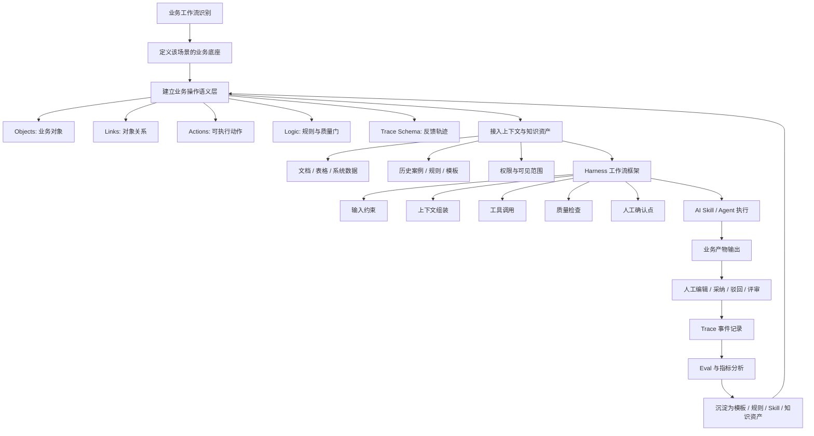
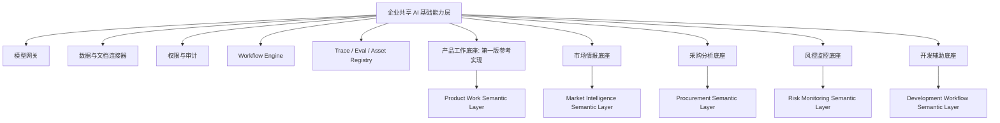
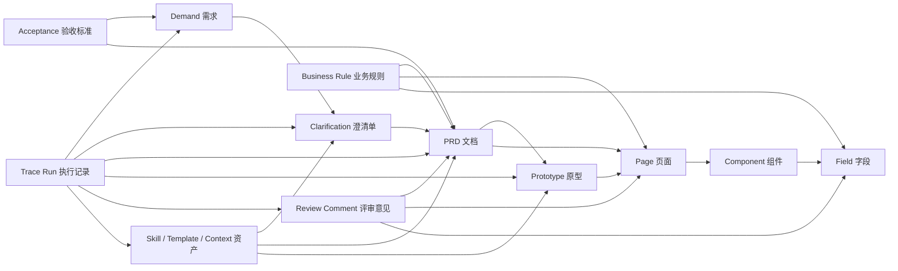
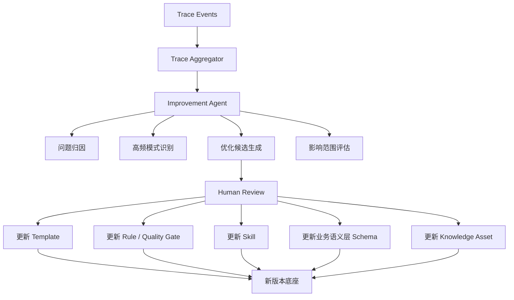
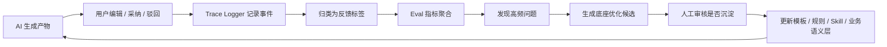
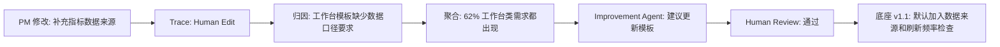

# 企业 AI 能力底座：作品集页面大纲与 Demo 页面清单

## 1. 项目定位

### 一句话版本

建设一套面向企业多业务工作流的可定制 AI 能力底座方法。它不是某一个单点 AI 工具，也不是一个大而全平台，而是让不同业务工作流都能基于自己的知识库、模板、规则和 Skill 形成专属底座，并通过真实使用中的 Trace、评估和人工反馈持续优化。

### 面向作品集的表达

这个项目试图回答一个问题：

> 当企业里出现很多 AI 单点提效工具之后，如何把一次性的 prompt、个人经验和业务反馈，沉淀成可复用、可评估、可持续优化的组织能力？

项目的核心不是只做一个产品团队工具，而是提出一种企业 AI 能力建设方式：以业务工作流为单位建立多个可进化底座。每个底座都围绕特定业务场景沉淀知识库、模板、规则、Skill、质量门和反馈轨迹，让业务团队能按自己的流程使用 AI，同时让企业侧从真实使用中沉淀共性能力。

“需求拆解 / PRD 生成 / HTML 原型生成”是作品集第一版的参考实现，也就是用产品工作流做一个样板间。它的作用是把抽象的企业 AI 底座逻辑讲具体，而不是限制项目本身的边界。作品集仍然要讲企业多业务底座，但第一版用一个场景做深，再用迁移矩阵说明它如何扩展到市场、风控、PPT / 汇报生成等其他工作流。

### 不建议的表达

- 不要把它讲成“AI 自动写 PRD 工具”。
- 不要把它讲成“只服务产品团队的工作流工具”。
- 不要把它讲成“一个大而全 AI 平台”。
- 不要把多个业务场景只列成口号，而不说明它们共享什么机制。
- 不要一开始就强调“本体论”这个词，而是先讲清楚它解决了什么问题。

### 推荐表达

> 我设计的是一套企业 AI 能力底座方法：让不同业务工作流都能基于自己的知识库、模板、规则和 Skill 形成可定制底座，并通过质量检查、Trace 和评估持续优化。作品集第一版用“产品工作底座”作为参考实现，演示需求拆解、PRD 生成、HTML 原型生成、一致性检查和 Trace 回流如何把一次性的 AI 产出变成可复用、可评估、可沉淀的组织能力。

---

## 2. 项目价值：从提效到组织能力

### 2.1 价值主张

这个项目的价值不只是让某个流程更快，而是让企业获得一种新的 AI 组织能力：

> 把分散在各业务线里的实践经验、人工判断、修改反馈和评审结果，转化成可复用、可验证、可进化的组织工作能力。

普通 AI 工具解决的是“这一次能不能更快产出”。企业 AI 能力底座解决的是“这一次真实使用留下的经验，能不能让下一次、下一个团队、下一个新人做得更好”。

因此，项目的核心不是统一所有业务流程，而是：

> 允许前台业务差异化，提炼后台共性能力。

### 2.1.1 商业价值锚点：少返工、少漏项、少重复搭建

这个项目不应该只讲“AI 提效”或“组织能力沉淀”。对业务部门和管理者来说，更直观的价值是：

> 减少高频知识工作流中的协同返工和质量风险，并把反复出现的问题沉淀成可复用的底座能力。

可以把价值拆成三层：

| 层次 | 价值 | 管理者为什么关心 |
| --- | --- | --- |
| 第一层：减少协同返工 | 让需求、原型、字段、权限、状态和验收标准提前结构化，减少评审、研发、测试反复确认 | 直接影响交付周期和人力消耗 |
| 第二层：降低质量风险 | 通过一致性检查提前发现 PRD 与原型不一致、状态缺失、权限边界不清、数据来源不明等问题 | 减少上线后问题、漏处理、错误决策和跨系统信息断点 |
| 第三层：沉淀组织资产 | 把高频修改、常见缺失项和优秀团队做法沉淀成模板、规则、组件和 Skill | 新人和其他团队不用重复踩坑，后续同类需求质量更稳定 |

对业务部门，可以讲成：

> 你不用反复被追问同样的字段、权限、数据来源和状态问题，系统会提前帮你检查出来。

对管理者，可以讲成：

> 重点不是某个 PM 写得更快，而是需求流转更稳定、返工更少、风险更早暴露、优秀团队的方法可以被复用。

第一版作品集建议把这套价值落到“角色化业务工作台生成”这个更通用的场景里：很多团队都想为不同岗位搭自己的工作台，但常见问题是角色目标不清、卡片优先级不清、数据来源不明、权限边界不清、状态覆盖不完整，最后导致反复沟通和重复搭建。

### 2.1.2 作品集证明策略：主叙事与参考实现

第一版作品集不需要同时做完多个业务底座，但需要让读者看到这个项目不是单点提效工具。更合理的证明方式是：

| 层级 | 作品集里怎么讲 | 作用 |
| --- | --- | --- |
| 上层主张 | 企业需要从单点 AI 工具走向可定制、可评估、可进化的业务底座 | 保留项目高度 |
| 共性框架 | 每个底座都由知识库、Skill、业务语义层、Harness、质量门、Trace / Eval 组成 | 说明不是只适用于 PRD |
| 参考实现 | 用产品工作底座演示需求拆解、PRD、HTML 原型、一致性检查和 Trace 优化 | 提供可运行证据 |
| 迁移说明 | 用市场、风控、PPT / 汇报生成等场景做共性机制对照 | 证明泛化路径 |

一句话说：主叙事是企业多业务 AI 能力底座，第一版 Demo 是产品工作流参考实现。

### 2.2 它带来的新增能力

| 能力 | 以前的问题 | 底座带来的变化 |
| --- | --- | --- |
| 隐性经验显性化 | 专家经验在个人脑子里，难以复制 | 人工修改、驳回原因、评审意见被沉淀为模板、规则、质量门和案例 |
| 局部经验组织化 | 一个业务线踩过的坑，其他业务线还会再踩 | 高频修改和高价值实践可以被筛选为组织级资产 |
| 新人快速进入业务体系 | 新人需要长期看文档、跟评审、被老人带 | 底座内置公司工作标准、历史案例、常见风险和待确认规则 |
| 产出质量稳定化 | 不同人员经验差异导致产物质量波动 | 基础结构、必填项、质量门和一致性检查让低级错误减少 |
| AI 失败可归因 | 只知道 AI 不好用，不知道问题在哪里 | Trace 可以定位是上下文、模板、规则、Skill、业务语义层还是边界问题 |
| 工作方法版本化 | 企业有文档版本和代码版本，但没有工作方法版本 | Skill、Harness、模板、规则、质量门、业务语义层都可以版本管理 |

### 2.2.1 多业务场景之间的共通性

这个项目的泛化点不是“所有业务都能生成一份文档”，而是很多企业工作流都具备同一类结构：

> 高频发生、依赖业务知识、有模板和规则、需要人工判断、产出物可检查，并且能从修改反馈中沉淀方法。

因此，产品工作底座只是第一版参考实现。它背后的机制可以迁移到其他结构化产物和业务判断工作流中。

| 共通机制 | 产品工作底座 | 市场情报底座 | 风控监控底座 | PPT / 汇报生成底座 |
| --- | --- | --- | --- | --- |
| 原始输入 | 一句话需求、背景材料、历史 PRD | 竞品动态、渠道数据、营销素材 | 页面、交易、规则、异常记录 | 汇报主题、业务数据、参考材料 |
| 知识库 | 历史 PRD、页面规范、业务规则、组件规范 | 竞品库、品牌策略、历史 campaign | 风控规则、历史案例、阈值策略 | 历史 deck、品牌规范、图表模板 |
| Skill | 需求拆解、PRD 生成、原型生成 | 情报摘要、趋势分析、策略建议 | 异常识别、风险分级、报告生成 | 大纲生成、页面生成、讲稿生成 |
| 业务语义层 | Demand、PRD、Prototype、Page、Field | Competitor、Channel、Campaign、Insight | Risk Event、Rule、Alert、Case | Topic、Slide、Chart、Narrative |
| 质量门 | PRD / 原型一致性、状态覆盖、权限规则 | 来源可信度、结论依据、策略一致性 | 误报漏报、风险等级、规则命中 | 结构完整、品牌一致、数据图表一致 |
| 人工反馈 | PM 修改、采纳、驳回、评审意见 | 市场同学修正判断和口径 | 风控同学调整等级和规则 | 用户改标题、图表、顺序和表达 |
| 回流资产 | 模板、字段、组件、质量规则 | 情报模板、竞品标签、策略库 | 风控规则、案例、预警模板 | 页面模板、表达结构、图表规范 |

作品集第一版可以只完整实现产品工作底座，但页面上要保留这张迁移矩阵，让招聘者看到：产品场景不是项目的边界，而是验证这套方法的第一个样板间。

### 2.3 个性化调优如何回流到底座

不同业务线拿到底座之后，会根据自己的实际场景进行个性化调优。例如在工作台生成场景中，销售团队可能加入客户跟进待办、销售漏斗指标和快捷入口；运营团队可能加入风险提醒、任务优先级和数据刷新频率；管理者视图可能加入团队指标、异常提醒和权限可见范围。

这些改动不能全部回流到底座。底座需要一个筛选机制，把业务线私有优化分成三层：

| 层级 | 含义 | 处理方式 |
| --- | --- | --- |
| 业务线私有优化 | 只适用于某个业务线的字段、规则、模板或流程 | 保留在业务线空间，不进入通用底座 |
| 可沉淀候选 | 多次出现、可能跨场景复用的优化 | 进入候选池，由 Improvement Agent 归因和聚合 |
| 底座能力升级 | 已验证能提升质量、降低风险或减少返工的共性能力 | 经人工审核后进入通用 Skill、Harness、模板、规则或业务语义层 |

### 2.4 什么内容值得回流到底座

不能因为某个业务线改了，就把改动全部收进底座。进入底座的内容至少要满足一部分标准：

| 判断维度 | 进入底座的理由 |
| --- | --- |
| 高频出现 | 多个业务线反复补同类内容 |
| 跨场景通用 | 不只适用于一个业务或一个项目 |
| 提升质量 | 能减少漏项、返工、评审问题或上线问题 |
| 降低风险 | 能避免权限、合规、数据、流程或安全错误 |
| 可标准化 | 能变成模板、规则、检查项、Skill 或业务语义层字段 |
| 可验证 | 上线后能通过采纳率、返工率、评审通过率等指标验证 |
| 不泄露敏感业务 | 可以抽象成共性能力，而不暴露业务私有细节 |

一句话：

> 只有那些反复出现、可迁移、可标准化、能提升质量或降低风险的改动，才值得回流到底座。

### 2.5 PRD Skill 的价值例子

单个 PRD Skill 的价值是帮 PM 更快写出初稿；可进化底座的价值是让公司不断沉淀“什么是好 PRD”。

当不同业务线围绕 PRD Skill 做个性化优化后，底座可以识别哪些内容只是业务线特有，哪些内容代表公司 PRD 质量体系里的共性缺口。例如多个业务线都在补充角色权限、指标口径、数据来源、刷新频率、空状态、风险提醒、快捷入口和验收标准，就说明这些内容应该进入通用 PRD Skill 或质量门。

这样一来，新人或校招生不需要经过很长时间培养，也能通过底座快速进入公司的业务体系。因为系统已经内置了：

- 公司 PRD 的结构和质量标准。
- 常见业务字段和术语。
- 权限、异常状态、数据来源、指标口径和角色差异。
- 历史高质量案例和常见评审意见。
- 哪些内容必须待确认，哪些业务判断不能让 AI 越界。

这背后的核心价值不是“新人写得更快”，而是：

> 企业把培养周期压缩了，把专家经验产品化了，把优秀业务线的方法扩散到了全组织。

### 2.6 商业价值路径

这个底座不一定直接产生收入，但它可以通过四条路径影响企业挣钱能力：

| 商业路径 | 价值说明 |
| --- | --- |
| 更快把业务想法变成可执行方案 | 缩短从信息、判断到方案、评审、执行的周期 |
| 减少返工和错误成本 | 降低评审返工、上线风险、采购误判、风控漏报等成本 |
| 复制优秀团队的方法 | 把优秀业务线的方法沉淀成默认能力，减少重复摸索 |
| 形成企业自己的 AI 数据飞轮 | 通用模型别人也能用，但企业自己的 trace、规则、反馈、案例和失败归因是外部没有的 |

### 2.7 可扩展价值场景：从单点提效到跨节点协同

产研测协同不应该被写成这个项目的主价值，否则项目会被误解成“产研协同工具”。更合适的定位是：

> 它是企业 AI 能力底座的一个可扩展价值场景，用来证明底座不仅能优化单个工作节点，也能优化节点之间的交接和对齐成本。

在很多企业里，即使 AI 让单个节点明显变快，项目总耗时也可能只缩短一小部分。原因是产品、研发、测试之间仍然依赖会议、群聊、钉钉消息和人工反复确认来传递上下文。单点 AI 缩短了“执行时间”，但没有解决“协同损耗”。

这个问题可以被定义为：

> Handoff Tax：单点与单点之间因为上下文丢失、责任不清、信息不结构化而产生的交接成本。

底座可以扩展去处理这个问题，但不是通过做一个会议总结工具，而是把跨角色交接中的对象结构化：

- 需求目标
- 范围 / 不做范围
- 验收标准
- 关键假设
- 待确认问题
- 研发关注点
- 测试关注点
- 变更记录
- 风险项
- 决策记录
- 责任人
- 当前状态

在产品工作底座的扩展场景中，可以形成两个典型交接产物：

| 交接场景 | 底座生成的结构化对齐包 |
| --- | --- |
| 产品 -> 研发 | 需求背景摘要、关键业务规则、待确认技术问题、影响范围、接口 / 数据 / 权限风险 |
| 研发 -> 测试 | 实现范围、PRD 与实现差异、重点测试路径、边界状态、异常状态、变更风险、回归测试建议 |

这类能力的价值不在于取消所有会议，而是把会议从“同步背景”变成“只讨论分歧和决策”。同时，Trace 可以记录哪些需求总是在研发阶段反复确认，哪些问题总是在测试阶段暴露数据口径、权限边界或状态覆盖缺失，从而反向优化 PRD 模板、研发 Checklist、测试质量门和跨角色交接规则。

这一场景可以用一句话总结：

> 单点 AI 优化任务执行，企业 AI 底座进一步优化任务之间的上下文流动、责任交接和协同闭环。

### 2.8 对“业务智能护城河”的更朴素定义

这里的护城河不是企业拥有某个更强的模型，而是企业能够把每天真实业务中的判断、修改、失败和复盘，持续沉淀成自己的工作系统。

时间越久，这套系统越理解公司如何做决策、如何交付、如何规避风险、如何培养新人。它积累的不是通用知识，而是公司自己的业务工作记忆。

可以把项目价值总结为：

> 让企业把分散在各业务线里的实践经验，转化成可复用、可验证、可进化的组织工作能力。

---

## 3. Section A: 技术路径与底座逻辑

### A1. 核心逻辑

这个项目面向的是企业里的多种工作流，而不是单个产品团队场景。每一类高频、重复、依赖经验、需要人工判断、并且产出物可以被检查的工作流，都可以被抽象成一个“业务底座”。

示例包括：

- 产品工作底座：需求澄清、PRD 生成、原型生成、一致性检查。
- 市场情报底座：竞品监控、渠道动态、营销素材复盘。
- 采购分析底座：报价解析、供应商对比、价格异常识别。
- 风控监控底座：页面巡检、异常识别、预警分级、历史留档。
- 开发辅助底座：需求理解、代码生成、测试检查、变更总结。

这些底座不是彼此孤立的应用。它们共享一套企业级基础能力，例如模型调用、权限、数据接入、文档解析、工作流编排、trace、评估和资产版本管理。差异在于每个底座有自己的业务对象、规则、模板、质量门和优化指标。

作品集第一版使用“产品工作底座”作为参考实现，而不是项目边界。它需要证明的是：当一个底座拥有知识库、Skill、业务语义层、Harness、质量门和 Trace / Eval 之后，AI 产出就不再只是一次性生成，而可以进入持续优化的组织工作流。

### A2. 总体技术流程图

### A3. 多底座架构图

### A4. 业务操作语义层 / Ontology 在技术里到底做什么

这里不建议一上来把 Ontology 讲成学术概念。更准确的说法是：每个业务底座都需要一层“业务操作语义层”。Domain Ontology 是其中描述业务对象和对象关系的部分，但这层不只做对象建模，还会进入运行链路，约束 AI 能看什么、能做什么、怎么检查、怎么记录反馈。

在这个项目里，这一层不是为了“让知识图谱看起来很高级”，而是为五件事服务：

1. **让输入可结构化**：把一堆文档、表格、对话、历史案例映射成业务对象。
2. **让 AI 可操作**：告诉 AI 当前能对哪些对象执行哪些动作。
3. **让流程可约束**：把 Skill、工具调用、人工确认点放进同一个 Harness。
4. **让检查可自动化**：把对象关系变成质量门和一致性规则。
5. **让 Trace 可学习**：让每次人工修改都能落到具体对象、规则、模板或上下文资产上。

以产品工作底座为例：

| 技术位置 | 业务语义层的作用 | 产品工作示例 |
| --- | --- | --- |
| 输入结构化 | 把原始材料映射为业务对象 | 一句话需求被识别为 Demand，补充材料被映射到 Context Asset |
| 上下文检索 | 决定应该检索哪些历史材料 | 需求类型是工作台，则优先检索工作台类 PRD、角色权限规则、指标口径和组件模板 |
| Agent / Skill 执行 | 给 AI 明确可操作对象和动作 | 可以生成 Clarification、PRD、Prototype，但不能替 PM 做上线决策 |
| 质量检查 | 根据对象关系检查一致性 | PRD 中的模块、指标、数据来源和权限说明必须在原型中有对应表达 |
| Trace 记录 | 定义哪些反馈有学习价值 | 记录 PM 改了模块优先级、补了数据来源、驳回了 AI 假设 |
| 底座优化 | 把高频反馈映射到资产 | 高频补“指标刷新频率”，则更新工作台模板和质量门 |

一句话讲：

> 业务操作语义层是 AI 底座里的业务操作地图。没有它，AI 只能生成文本；有了它，AI 才能围绕业务对象、规则、质量门和反馈闭环工作。

### A4.1 产品工作底座业务操作语义图

产品工作底座的语义层可以先画成一个“轻量业务对象图”，不需要一开始做成完整知识图谱。第一版重点展示 8 到 10 个关键对象，以及它们如何支撑生成、检查和 Trace。

这张图在作品集里可以承担两个作用：

- **给非技术读者看**：产品工作不是一篇 PRD 文档，而是一组对象、关系、动作和检查规则。
- **给技术读者看**：后续的 RAG、Agent、质量检查、Trace 都不是凭空做的，而是围绕这些对象运行。

### A4.2 业务操作语义层和 Graph RAG / LightRAG 的区别

Graph RAG、LightRAG 这类方法主要解决“怎么从文档里检索到更有关联的上下文”。它们会把文本中的实体和关系抽出来，辅助检索多跳关系或全局主题。

但企业 AI 底座里的业务操作语义层更宽。它不仅用于检索，还定义业务对象、权限、动作、质量规则、人工确认点、Trace Schema 和可沉淀资产。换句话说：

| 概念 | 主要解决什么 | 在本项目中的位置 |
| --- | --- | --- |
| Vector RAG | 从文本块里找相关内容 | Context Builder 的一种检索方式 |
| Graph RAG / LightRAG | 从实体关系图里找相关上下文 | Context Builder 的增强检索方式 |
| Domain Ontology | 定义业务对象和对象关系 | 业务操作语义层中的对象建模部分 |
| 业务操作语义层 | 定义对象、动作、规则、质量门、人工确认点和 Trace Schema | 整个底座的运行语义层 |
| Harness | 把输入、检索、AI、工具、质量门、人工确认串成稳定流程 | 底座的运行框架 |
| Agent | 在 Harness 约束下选择动作、调用工具、分析 trace、提出优化 | 底座的智能执行和优化单元 |

所以第一版不需要证明“我实现了一个完整知识图谱 RAG 系统”。更清楚的讲法是：底座需要业务操作语义层作为运行骨架；Domain Ontology 是其中的对象和关系部分；Graph RAG / LightRAG 可以作为上下文检索的一种技术选项，但不是底座本身。

### A5. Harness 应该怎么设计

你可以把“底座本身”理解成一个 Harness。Harness 是让 AI 稳定工作的运行框架，负责把输入、上下文、规则、工具、检查、人工确认和 trace 组织起来，避免 AI 变成一次性自由发挥。

换句话说：

> 底座 = 知识库 + Skills / Agents + 业务操作语义层 + Harness + Tools + Quality Gates + Trace / Eval + Asset Registry

一个底座的 Harness 至少包含：

| 模块 | 作用 | 示例 |
| --- | --- | --- |
| Input Contract | 限定输入格式和最低信息要求 | 需求标题、业务线、需求类型、背景材料 |
| Context Builder | 组装模型需要的上下文 | 历史 PRD、业务规则、术语表、页面规范 |
| Skill Router | 决定调用哪个 AI 能力 | 需求澄清 skill、PRD skill、原型 skill、检查 skill |
| Tool Layer | 允许 AI 调用确定性工具 | 文档解析、检索、diff、HTML 渲染、一致性检查 |
| Guardrails | 限制 AI 的边界 | 不确定必须标记待确认，不得编造业务规则 |
| Quality Gates | 对输出做自动检查 | 必填章节、字段一致性、状态覆盖、权限规则 |
| Human Checkpoints | 让人负责关键判断 | PM 确认范围、采纳建议、提交评审 |
| Trace Logger | 记录每一步可学习信号 | 输入、输出、修改、采纳、驳回、返工原因 |

### A6. 是否需要 Agent

如果只是演示“从输入到产物输出”，固定 Workflow 是够的；但如果要证明“底座会基于 Trace 自我优化”，只靠 Workflow 就不太够。因为优化闭环里需要一个能读 trace、归因问题、提出资产更新建议的智能角色，这更像 Agent。

更准确的结论是：

> 生成链路可以先用 Workflow，优化链路最好引入 Agent。

也就是说，第一版不必做完全自主的多 Agent 系统，但应该在技术流程图里明确两个层次：

- **Execution Workflow / Agent**：负责按 Harness 运行生成、检索、检查、人工确认。
- **Improvement Agent**：负责分析 Trace，归因问题，并提出模板、规则、Skill、业务语义层或知识库的优化候选。

推荐分三层理解：

| 阶段 | 形态 | 适合做什么 |
| --- | --- | --- |
| V0: Harness + Workflow + Skill | 固定流程，按步骤调用 AI | 需求澄清、PRD 草稿、原型草稿、质量检查 |
| V1: Harness + Orchestrated Agent | 在约束内选择工具和下一步 | 判断信息是否足够、选择模板、调用检索、触发检查 |
| V2: Harness + Improvement Agent | 分析 trace，提出底座优化建议 | 更新模板、规则、Skill、业务语义层、知识资产 |
| V3: Multi-Agent Collaboration | 多个专门 Agent 协作 | PM Agent、Design Agent、QA Agent、Semantic Layer Optimizer |

当前作品集 demo 建议至少讲到 V2，但实现上可以 mock。也就是：前台 demo 展示固定 Workflow，后台技术图展示 Improvement Agent 如何读 Trace 并给出底座优化候选。这样既能证明闭环，又不会把周末工作量拉爆。

### A6.1 Agent 在 Trace 优化中的位置

Improvement Agent 不应该直接自动改底座。更合理的是：

- Agent 负责发现模式、提出建议、生成变更草案。
- 人负责审核、确认、发布新版本。
- Harness 负责确保新版本可追踪、可回滚、可评估。

### A7. Trace 优化底座的完整闭环

Trace 不是简单埋点。它需要服务于底座优化，所以每条 trace 最好能回答三个问题：

1. 用户为什么改？
2. 这次修改暴露的是输入问题、规则问题、模板问题、上下文问题，还是 AI 边界问题？
3. 这个问题是否在多个业务或多次运行中重复出现，值得沉淀为共性资产？

### A7.1 Trace 应该拆成哪些事件

Trace 不建议只记录一条“用户反馈”。更好的做法是拆成事件流，并且把用户负担控制到最低。第一版可以先分成三类：

| Trace 类型 | 记录内容 | 用户负担 | 示例 |
| --- | --- | --- | --- |
| 系统自动捕获 | 输入、材料、Skill 调用、模板版本、生成结果、质量门结果、编辑 diff、重生成次数 | 无负担 | 系统发现原型出现“团队排行榜”，但 PRD 没有定义数据来源和可见范围 |
| 用户轻量确认 | 采纳 / 驳回、修改原因标签、是否待确认、是否值得沉淀 | 低负担 | PM 选择“AI 越界假设”“模板缺少数据来源”“术语不准” |
| 关键节点追问 | 是否进入评审、哪些改动值得回流、哪些问题必须人工判断 | 只在关键节点出现 | 提交 PRD 前询问“本次新增的风险提醒卡片是否可沉淀为通用组件候选” |

原则是：能自动捕获的就自动捕获，不能自动判断的才让人用标签确认，只有影响底座升级或业务决策时才追问。

事件本身要绑定到业务操作语义层中的对象、Harness 步骤和资产版本。

| Trace Event | 记录什么 | 绑定对象 |
| --- | --- | --- |
| Input Submitted | 用户输入了什么需求和材料 | Demand、Context Asset |
| Context Retrieved | 系统检索了哪些历史材料 | Knowledge Asset、Template |
| Skill Executed | 调用了哪个 Skill / Agent | Skill、Trace Run |
| Output Generated | AI 生成了什么产物 | Clarification、PRD、Prototype |
| Quality Gate Triggered | 触发了哪些检查 | Business Rule、Field、Page |
| Human Edit | 用户改了哪里 | PRD Section、Page、Field、Rule |
| Suggestion Adopted | 哪些 AI 建议被采纳 | Risk、Acceptance、Review Comment |
| Suggestion Rejected | 哪些 AI 建议被驳回 | AI Output、Review Comment |
| Regeneration Requested | 为什么重新生成 | Skill、Template、Context |
| Review Result Updated | 评审是否通过、为何返工 | Review Comment、Acceptance |
| Asset Candidate Created | 哪些修改可能沉淀为资产 | Template、Rule、Skill、业务语义层 |

### A7.2 Trace 字段设计

| 字段 | 说明 |
| --- | --- |
| trace_id | 单个事件 ID |
| run_id | 一次工作流执行 ID |
| workflow_step | 当前步骤：澄清、PRD、原型、检查、评审 |
| object_type | 关联对象类型：Demand、PRD、Page、Field 等 |
| object_id | 具体对象 ID |
| asset_version | 使用的 Skill / Template / Rule / 业务语义层版本 |
| before_snapshot | 修改前摘要或结构化片段 |
| after_snapshot | 修改后摘要或结构化片段 |
| edit_type | 新增、删除、重写、字段改名、状态补充、规则修正 |
| feedback_tag | 缺背景、模板不匹配、字段不准、状态缺失、AI 越界 |
| capture_mode | 自动捕获、用户轻量确认、关键节点追问 |
| actor | 用户、Agent、系统检查器 |
| confidence | 系统对归因的置信度 |
| human_reason | 用户显式填写或选择的修改原因 |
| improvement_target | 可能要优化的资产：Context、Template、Rule、Skill、业务语义层 |

### A7.3 Trace 到底如何变成底座优化

Trace 不能直接等于优化。中间至少有四步：

1. **事件采集**：记录用户在哪里改、改了什么、为什么改。
2. **归因分类**：判断问题来自上下文、模板、规则、Skill、业务语义层还是 AI 边界。
3. **聚合判断**：看它是否高频、跨业务重复、对质量影响是否足够大。
4. **资产变更**：生成模板、规则、Skill、知识库或业务语义层的更新候选，由人审核发布。

示例：

| 高频 Trace | Improvement Agent 归因 | 底座优化候选 |
| --- | --- | --- |
| 多次补充“指标数据来源” | 工作台模板缺少数据口径要求 | 更新工作台模板和质量门 |
| 多次调整“待办优先级” | 任务排序规则没有问清 | 更新澄清问题模板和排序规则 |
| 多次删除 AI 的“团队排行榜”假设 | AI 越过业务判断边界 | 更新 Guardrail 和待确认策略 |
| 多次回头补角色目标 | 澄清 Skill 没问清工作台服务对象 | 更新澄清问题模板 |
| PRD 和原型字段反复不一致 | 对象映射规则不足 | 更新 PRD -> Prototype 映射规则 |

### A7.4 作品集里 Trace 的展示方式

作品集不要只展示数据表，最好展示一个“从修改到优化”的因果链：

### A8. Base Improvement Evaluation：如何证明底座真的变好了

底座更新不能只靠“感觉更好”。每次模板、规则、Skill、Harness 或业务语义层更新之后，都需要通过指标验证它是否真的改善了后续工作流。

作品集里可以用一个轻量 baseline 设计来证明思路：

| 版本 | 代表状态 | 用来证明什么 |
| --- | --- | --- |
| V0：通用 AI 直接生成 | 只给模型一句话需求和少量背景，让它直接产出 PRD / 原型 | 单点生成容易遗漏规则、状态和上下文 |
| V1：加入产品工作底座 | 接入知识库、模板、业务语义层、Harness 和质量门 | 底座能让产物更结构化、更可检查 |
| V2：Trace 优化后的底座 | 根据人工修改和一致性检查结果更新模板、规则或组件规范 | 底座能通过真实反馈减少同类问题复发 |

第一版可以先用 mock 数据展示这组三段式对照，不必真的跑大规模实验。重点是让读者看到：底座不是一次生成能力，而是一个可比较、可迭代、可评估的工作系统。

可以把评估框架分成五层：

| 评估层 | 关注问题 | 代表指标 |
| --- | --- | --- |
| Quality 产物质量 | AI 生成的东西是不是更可用 | 首稿采纳率、人工编辑率、重生成次数、质量门通过率 |
| Efficiency 流程效率 | 单点和端到端耗时有没有下降 | 需求到 PRD 初稿耗时、PRD 到研发确认耗时、评审周期、返工周期 |
| Trace 学习效果 | 同类问题有没有减少 | 高频问题复发率、同类修改下降率、反馈归因准确率、优化建议采纳率 |
| Asset 资产沉淀 | 经验有没有变成可复用资产 | 新增模板数、新增规则数、Skill 版本迭代、跨业务复用率 |
| Business 业务结果 | 是否减少损失或改善交付 | 需求交付周期、评审返工率、上线后问题率、人均处理需求数 |

#### A8.1 产物质量指标

| 指标 | 含义 | 期望变化 |
| --- | --- | --- |
| 首稿采纳率 | AI 生成内容有多少被保留 | 上升 |
| 人工编辑率 | 人工修改占输出内容的比例 | 下降 |
| 重生成次数 | 同一任务反复生成几次 | 下降 |
| 待确认项有效率 | AI 提出的问题是否减少后续返工 | 上升 |
| 质量门通过率 | PRD、原型、检查项一次通过比例 | 上升 |

#### A8.2 流程效率指标

| 指标 | 含义 |
| --- | --- |
| 从需求输入到 PRD 初稿耗时 | 单节点效率 |
| 从 PRD 到研发确认耗时 | 跨角色对齐效率 |
| 从研发完成到测试理解耗时 | Handoff 效率 |
| 评审一次通过率 | 协同质量 |
| 返工周期 | 从发现问题到修正完成的时间 |

这组指标可以回应“单点开发时间大幅缩短，但项目总耗时只缩短一部分”的问题。底座真正优化后，不仅单点时间下降，交接时间、返工周期和评审周期也应该下降。

#### A8.3 Trace 反馈指标

| 指标 | 含义 |
| --- | --- |
| 高频问题复发率 | 已优化的问题是否还反复出现 |
| 同类修改下降率 | 例如补异常状态、改字段名、补权限规则这类修改是否减少 |
| 反馈归因准确率 | Improvement Agent 判断问题来源是否被人认可 |
| 优化建议采纳率 | Agent 提出的底座优化建议有多少被采纳 |
| 资产回流转化率 | 候选改动中有多少变成正式底座资产 |

这组指标最能证明“底座在学习”。如果底座更新后，同一类 Trace 还高频出现，说明优化没有真正解决问题。

#### A8.4 组织资产指标

| 指标 | 含义 |
| --- | --- |
| 新增可复用模板数 | 从业务线回流的模板资产 |
| 新增质量规则数 | 沉淀出的检查项和规则 |
| Skill / Harness 版本迭代次数 | 底座能力是否持续更新 |
| 跨业务复用率 | 一个业务线沉淀的资产是否被其他业务线使用 |
| 新人独立完成率 | 新人借助底座完成任务的比例 |

这组指标对应“新人和校招生快速进入业务体系”的价值。真正有价值的不是新人写得更快，而是新人更快达到公司的质量标准。

#### A8.5 评估闭环例子：工作台数据来源缺失

| 阶段 | 观察 |
| --- | --- |
| 优化前 | 多个工作台 PRD 需要 PM 手动补数据来源、刷新频率、角色权限和空状态，评审阶段反复追问模块依据 |
| Trace 发现 | 62% 工作台类需求都补了“指标数据来源和刷新频率”，48% 原型修改集中在待办优先级、风险提醒位置和快捷入口排序 |
| 底座优化 | PRD 模板加入“角色目标 / 数据来源 / 刷新频率 / 权限边界”章节，原型 Harness 默认生成空 / 错 / 加载 / 无权限状态，一致性检查加入数据口径和模块来源质量门 |
| 优化后验证 | 数据来源相关人工补充次数下降，原型一次评审通过率上升，评审阶段关于模块依据的追问减少，同类问题复发率下降 |

可以把“底座是否真的变好”总结成一句：

> 如果一次底座更新之后，同类任务的采纳率提高、人工修改减少、返工下降、跨角色对齐更快、同类问题复发率降低，并且沉淀资产被更多业务复用，就说明底座确实得到了优化。

### A9. 作品集里的技术讲法

作品集里可以把技术路径压成一句主线：

> 先为一个业务工作流建立业务操作语义层，再用 Harness 把知识库、AI skill、工具、质量门和人工确认串起来，最后通过 Trace 与 Eval 把真实使用反馈沉淀回模板、规则、知识库和底座能力中。

PRD / 原型生成场景是这条技术路径的第一版参考实现，不是项目边界。

### A10. Palantir Ontology 对本项目的启发边界

Palantir 的启发不在于“也做一个 Palantir”，而在于它把企业 AI 的核心问题从“找数据、问模型”推进到“围绕业务对象做决策、行动和反馈”。

可以借鉴的部分：

- **业务对象化**：把企业工作中的真实对象建模，而不是只管理文档。
- **动作可追踪**：每次操作、修改、提交、确认都应该留下上下文。
- **决策数据化**：不只记录结果，也记录人为什么这么改、AI 为什么这么建议。
- **安全和权限内生化**：AI 可见、可说、可做的范围必须由底座控制。
- **Agent 记忆来源**：Agent 的长期改进不只靠聊天记录，而靠结构化的 trace、eval 和业务结果。

不必照搬的部分：

- 不需要第一版就做企业级完整 Ontology 平台。
- 不需要一开始就接入所有业务系统。
- 不需要把所有知识都图谱化。
- 不需要让 Agent 自动修改底座核心资产。

本项目更适合的表达是：

> 借鉴 Palantir Ontology 的思路，把企业工作流中的对象、动作、规则、安全和决策痕迹结构化；但在作品集实现上，用一个轻量产品工作底座 demo 证明这种结构如何支撑 AI 生成、质量检查和 trace 反馈闭环。

---

## 4. 作品集页面整体结构

### 当前页面设计原则

这里先不固定最终网页要分几个 Tab。更好的做法是先确定叙事层级，再决定交互形式。

推荐采用“主叙事页面 + 产品工作流参考实现 + 多业务迁移矩阵”的结构，而不是把所有内容堆成多个并列页面：

- 主叙事负责解释：为什么需要企业 AI 能力底座、底座如何工作、为什么它会进化。
- 产品工作流参考实现负责证明：这个逻辑可以落到一个具体业务底座里，例如需求拆解、PRD 生成、HTML 原型生成、一致性检查和 Trace 优化。
- 多业务迁移矩阵负责说明：产品工作流不是项目边界，同一套机制可以迁移到市场、风控、PPT / 汇报生成等工作流。
- 技术流程图负责回答：业务语义层、Harness、Agent、Trace 分别在链路中做什么。

视觉风格先保留为待定。后续可以根据参考网页再确定是偏 research lab、enterprise AI console、systems map，还是 portfolio case study。

### Section 1: 项目封面

**目标：** 让读者 10 秒内知道这是一个什么项目。

**页面内容：**

- 项目名：企业 AI 能力底座
- 副标题：从单点 AI 提效到多工作流可进化底座
- 一句话定位
- 一个核心流程视觉：
  `业务工作流 -> 业务操作语义层 -> Harness -> AI Skill / Agent -> 业务产物 -> Human Feedback -> Trace / Eval -> 底座优化`
- 角色标签：Enterprise AI / Workflow Design / Semantic Layer / Harness / Trace / Eval / Agentic Workflow

**可视化建议：**

- 用一条横向系统链路作为第一视觉。
- 右侧可以放多个底座的抽象卡片，其中产品工作底座作为当前 demo 高亮。

---

### Section 2: 背景问题

**目标：** 解释为什么这个项目值得做。

**核心论点：**

很多企业环节已经开始用 AI 做单点提效，但常见问题是：

- 信息分散：文档、表格、系统数据、会议纪要、历史案例和业务规则散落在不同位置。
- 重复劳动：不同团队反复做采集、整理、判断、生成、复查和汇报。
- 经验依赖：关键判断依赖专家经验，难以被新人或其他业务线复用。
- 产物割裂：输入、过程、产物、评审意见和业务结果之间缺少结构化关联。
- 反馈难沉淀：AI 输出被改了哪里、为什么改、哪些模板失效，很难被追踪。

**可视化建议：**

- 左侧展示“单点 AI 工具”的碎片化状态。
- 右侧展示“底座化之后”的闭环状态。

---

### Section 3: 核心洞察

**目标：** 讲清楚你真正的产品判断。

**核心观点：**

AI 产品的长期价值不只是“生成一次内容”，而是形成一个持续学习循环：

1. 业务团队使用某个场景底座完成具体工作。
2. 人工修改、采纳、驳回、补充业务判断。
3. 系统记录修改点、卡点、采纳情况和评审结果。
4. 高频问题被沉淀成规则、模板、知识资产或质量门。
5. 下一次生成质量更高。

**重点句：**

> 真正可复用的不是某个聊天入口，而是每类业务工作流中的对象、关系、动作、规则和反馈轨迹。

**可视化建议：**

- 做一个循环图：Use -> Edit -> Trace -> Learn -> Improve。
- 每个环节旁边标注一个真实例子，例如“PM 高频补数据来源 -> 工作台模板默认增加指标口径和刷新频率检查”。

---

### Section 4: 业务操作语义层

**目标：** 用通俗方式解释“业务操作语义层”在企业多底座中的作用，并说明它包含但不等同于 Domain Ontology。

**表达方式：**

不要先讲概念定义，先讲用途：

> 为了让 AI 稳定参与业务工作，需要先把每类工作流拆成它能理解、操作、检查和记录反馈的结构。

**五个组成部分：**

| 组成 | 含义 | 示例 |
| --- | --- | --- |
| Objects | 业务工作对象 | 需求、供应商、竞品事件、素材 brief、风险项、页面、组件、规则、Trace Run |
| Links | 对象关系 | 需求生成 PRD、供应商对应报价、竞品事件影响渠道策略、风险项触发预警 |
| Actions | 可执行动作 | 生成澄清问题、生成 PRD、比价评分、监控预警、生成素材、提交评审 |
| Logic | 规则与护栏 | 模板规则、业务规则、质量门、权限边界、人工确认点 |
| Trace | 反馈轨迹 | 人工修改 diff、采纳状态、重生成原因、评审结果、可沉淀资产 |

**可视化建议：**

- 用一张总图展示“企业共享能力层 + 多个业务操作语义层”。
- 再用产品工作底座作为放大镜，展示 Demand、PRD、Prototype、Page、Field、Trace Run 的连接。

---

### Section 5: 核心 Demo 流程

**目标：** 让读者看到这个底座如何落地到一个具体场景。

**定位提醒：** 这一段是产品工作流参考实现，不是整个项目的边界。它只负责说明企业 AI 能力底座如何落到一个具体业务工作流中。

**建议使用一个固定示例需求：**

> 业务团队希望为不同岗位生成一个个性化业务工作台，让员工进入系统后能看到自己的待办事项、关键指标、常用功能入口、风险提醒和最近处理记录，减少在多个系统之间来回切换和漏处理任务。

**Demo 主流程：**

1. 输入一句话需求和背景材料。
2. AI 生成澄清问题。
3. 用户补充回答后生成结构化澄清单。
4. AI 生成 PRD 草稿。
5. AI 根据 PRD 生成 HTML 原型。
6. 系统检查 PRD 与原型一致性。
7. PM 修改、采纳、驳回部分建议。
8. Trace 面板展示本次修改和可沉淀资产。
9. 底座优化台展示本次或多次 Trace 如何转化成模板、规则、组件或 Skill 的优化候选。

**可视化建议：**

- 这一段是作品集页面中最适合放截图的区域。
- 每一步都用一张小截图或一个局部 UI 卡片说明。

---

### Section 6: Trace 如何让底座进化

**目标：** 把项目从“生成器”拉回“底座”。

**需要讲清楚的 Trace 不是使用次数，而是可学习信号：**

| Trace 信号 | 可能说明 | 底座优化方向 |
| --- | --- | --- |
| PM 高频补充业务目标 | 澄清问题没有问清价值 | 优化需求澄清 skill |
| PM 高频补充异常状态 | 页面模板状态覆盖不足 | 更新页面状态质量门 |
| 字段命名反复被修改 | 术语库或字段规则不准 | 优化术语表和字段规范 |
| 原型与 PRD 差异频繁 | 映射规则不足 | 增强 PRD / 原型一致性检查 |
| AI 自行假设方案被删除 | AI 越过业务判断边界 | 强化边界规则和待确认策略 |
| 多业务线新增同类组件 | 组件库缺少共性组件 | 沉淀为通用组件模板 |

**作品集里的关键表达：**

> Trace 的目的不是监控个人，而是发现底座在哪里没有理解业务、哪些能力值得复用、哪些规则应该升级。

---

### Section 7: 第一版作品集 MVP 范围

**目标：** 显示你有产品取舍，同时避免把整个项目误读成“只做 PRD / 原型生成”。

作品集里的 MVP 不是企业全部底座的 MVP，而是“企业 AI 能力底座方法 + 产品工作流参考实现”的 MVP。它的作用是证明方法论可以落到具体工作流里，并且通过质量检查和 Trace 形成优化闭环。

**第一版必选证明链：**

- 一句话需求输入
- AI 需求澄清问题生成
- 结构化澄清单
- PRD 草稿生成
- HTML 原型草稿预览
- PRD / 原型一致性检查
- Trace Run 详情
- 底座优化台：展示 Trace 如何转化为模板、规则、组件或 Skill 的优化候选
- 多业务迁移矩阵：说明同一套机制如何迁移到市场、风控、PPT / 汇报生成等场景

**第一版可以 mock 的部分：**

- AI 输出可以用预置案例模拟
- HTML 原型可以用静态页面或 iframe 展示
- Trace 可以用 mock event log 展示一次 run 的全过程
- 底座优化台可以先展示 3 到 5 条聚合洞察，不需要真实后台计算
- 迁移矩阵可以是静态说明，不需要做第二个完整业务底座

**第一版暂不包含：**

- 真实 LLM 调用
- 登录和复杂权限
- 多业务线管理后台
- 真正的文档上传解析
- 自动 diff 算法
- 后端数据库
- 自动发布底座资产
- 接管研发排期、测试、上线发布流程

**后续 V0.2：**

- 真实 LLM 调用
- 可上传知识库材料
- 更完整的 PRD / 原型一致性检查
- 原型编辑 Trace
- 模板和规则版本展示

**后续 V0.3：**

- 业务线模板定制
- Trace 聚合分析
- 高频共性资产推荐
- Skill / 模板 / 规则版本管理
- 第二个轻量底座样例，例如 PPT / 汇报生成或市场情报摘要

---

### Section 8: 示例场景的技术切片

**目标：** 把 Section A 的总技术路径落到一个可展示、可截图、可讲清楚的案例里。

**产品工作底座的技术切片：**

| 层级 | 在示例 demo 中做什么 | 可讲技术 |
| --- | --- | --- |
| 业务操作语义层 | 定义 Demand、Clarification、PRD、Prototype、Page、Field、Trace Run，以及可执行动作和质量规则 | schema、对象关系、动作边界、业务语义层 |
| Context Layer | 接入历史 PRD、业务规则、页面规范、术语表 | 文档解析、RAG、权限过滤 |
| Harness | 串起澄清、PRD、原型、检查和人工确认 | workflow orchestration、guardrails、quality gate |
| Skill / Agent | 执行生成、检索、检查、总结等任务 | LLM skill、tool calling、agent routing |
| Trace / Eval | 记录修改、采纳、驳回、评审和高频问题 | diff、event log、指标聚合、反馈标签 |

**第一版 demo 的技术实现可以很轻：**

- 前端：React / Next.js / Vite 均可。
- 数据：本地 JSON mock，不需要真实后端。
- AI 输出：先用预置案例模拟。
- 原型预览：用内嵌 HTML 或 iframe 展示。
- Trace：用 mock event log 展示一次 run 的全过程。

**讲法：**

第一版的重点不是证明模型能力，而是证明底座逻辑、业务操作语义层、Harness 约束、质量门和 Trace 闭环成立。真实模型调用可以放在后续版本。

---

### Section 9: 多业务迁移矩阵

**目标：** 防止读者把产品工作流参考实现误读成项目全部边界。

这一节不需要做成第二个完整 demo，而是用一张矩阵展示同一套底座机制如何迁移到其他业务工作流。重点不是“还能生成别的东西”，而是说明这些工作流共享同一种底层结构：知识库、Skill、业务语义层、质量门、人工反馈和 Trace 回流。

**建议展示场景：**

- 产品工作底座：需求拆解、PRD、HTML 原型、一致性检查。
- 市场情报底座：竞品摘要、渠道动态、策略建议、来源可信度检查。
- 风控监控底座：异常识别、风险分级、预警报告、误报漏报反馈。
- PPT / 汇报生成底座：大纲、HTML slide、讲稿、品牌和数据一致性检查。

**关键表达：**

> 产品工作底座是第一版参考实现；真正可迁移的是“知识库 + Skill + 业务语义层 + Harness + 质量门 + Trace / Eval”的底座框架。

---

## 5. Demo 页面清单

第一版不需要把每个页面都做成完整产品，只需要让核心证明链可点击、可截图、可讲清楚。推荐把 Demo 页面分成两类：

| 类型 | 页面 | 作用 |
| --- | --- | --- |
| 核心证明页 | Demo 1、Demo 4、Demo 5、Demo 6、Demo 7、Demo 8 | 证明从需求到产物、检查、Trace 和底座优化的闭环 |
| 支撑流程页 | Demo 0、Demo 2、Demo 3 | 补足从输入到 PRD 的过程，让故事顺畅 |

Demo 6 和 Demo 8 不建议再放到可选项里。它们是把项目从“生成器”拉回“可进化底座”的关键证据。

### Demo 0: 案例首页 / 工作台

**作用：** 作为 demo 入口，展示当前 run 的状态。

**主要内容：**

- 当前示例需求标题
- 流程进度条
- 输入材料数量
- 当前生成产物：澄清单、PRD、原型、检查报告
- Trace 状态：已记录修改、采纳建议、待沉淀资产

**适合截图：** 是。可以作为整个项目的主截图。

---

### Demo 1: 需求输入页

**作用：** 展示用户如何从一句话需求开始。

**主要内容：**

- 需求标题
- 一句话描述
- 业务线
- 需求类型
- 优先级
- 相关背景材料
- 历史 PRD / 页面规范 / 业务规则入口

**建议预置输入：**

> 业务团队希望为不同岗位生成一个个性化业务工作台，让员工进入系统后能看到自己的待办事项、关键指标、常用功能入口、风险提醒和最近处理记录，减少在多个系统之间来回切换和漏处理任务。

**关键交互：**

- 点击“生成澄清问题”
- 系统判断当前信息是否足够进入澄清阶段

**适合截图：** 是。适合展示“从模糊需求开始”的场景。

---

### Demo 2: AI 需求澄清页

**作用：** 展示 AI 不是直接生成 PRD，而是先补齐价值、范围、边界和验收标准。

**主要内容：**

- AI 生成的问题列表
- 分类：Value、Range、Acceptance、Boundary、Dependency
- 用户回答区
- 待确认标记
- 完整度评分或缺口提示

**示例问题：**

- 这个工作台主要服务哪些岗位？例如一线员工、主管、运营、客服或销售。
- 每类角色进入工作台后最需要先看到什么：待办、指标、风险提醒、快捷入口还是最近处理记录？
- 每个指标卡的数据来源、刷新频率和统计口径是什么？
- 哪些模块需要按角色或权限展示，哪些信息不能被所有人看到？
- 风险提醒由哪些规则触发？是否需要区分高、中、低优先级？
- 工作台上线前的验收标准是什么？例如减少跨系统跳转、降低漏处理任务、提升待办处理及时率。

**关键交互：**

- 用户填写回答
- 点击“生成结构化澄清单”

**适合截图：** 是。非常适合体现 PM 思维。

---

### Demo 3: 结构化澄清单页

**作用：** 展示从对话式信息到结构化产品材料的转换。

**主要内容：**

- 业务背景
- 目标
- 用户角色
- 范围
- 不做范围
- 验收标准
- 风险和依赖
- 待确认项

**关键交互：**

- PM 可以编辑结构化字段
- 系统记录修改类型
- 点击“生成 PRD 草稿”

**适合截图：** 是。适合展示“底座把信息结构化”的能力。

---

### Demo 4: PRD 草稿编辑页

**作用：** 展示 AI 生成的 PRD 不是终稿，而是 PM 可编辑、可确认的工作草稿。

**主要内容：**

- PRD 目录
- 背景与目标
- 业务流程
- 功能需求
- 页面说明
- 字段规则
- 异常状态
- 权限规则
- 验收标准
- 风险与待确认项

**关键交互：**

- PM 编辑段落
- 标记“采纳 / 修改 / 驳回”
- 查看 AI 引用的上下文依据
- 点击“生成 HTML 原型”

**适合截图：** 是。适合作为作品集的核心产品截图。

---

### Demo 5: HTML 原型预览页

**作用：** 展示 PRD 如何转成可浏览的页面草稿。

**主要内容：**

- 原型 iframe 或页面预览区
- 页面列表
- 状态切换：默认、加载、空状态、异常、无权限
- 组件标注：待办卡片、指标卡、风险提醒、快捷入口、最近处理记录、状态标签

**建议原型页面：**

- 个人工作台首页
- 角色化模块配置页
- 待办详情抽屉
- 风险提醒列表页
- 快捷入口管理页

**关键交互：**

- 切换页面
- 切换状态
- 查看该页面对应的 PRD 段落

**适合截图：** 是。它会让案例不再只是文档。

---

### Demo 6: PRD / 原型一致性检查页

**作用：** 展示底座的质量门，而不是只做生成。

**主要内容：**

- PRD 中存在但原型缺失的字段
- 原型中存在但 PRD 未说明的操作
- 缺少的状态覆盖
- 权限 / 数据来源 / 角色规则不一致
- 检查结果的严重程度

**示例检查结果：**

- PRD 提到“风险提醒”，原型缺少风险提醒模块入口。
- 原型中出现“团队排行榜”，但 PRD 未定义数据来源、统计口径和可见范围。
- 指标卡片缺少刷新时间和数据延迟说明。
- 待办列表缺少空状态、加载失败状态和无权限状态。

**关键交互：**

- PM 标记采纳、忽略、待确认
- 点击“写入 Trace”

**适合截图：** 是。适合体现产品质量意识。

---

### Demo 7: Trace Run 详情页

**作用：** 展示一次 AI 工作流留下了哪些可学习信号。

**主要内容：**

- run_id
- 业务线
- 需求类型
- 使用的 skill / template / context
- 输入摘要
- 输出摘要
- 人工修改摘要
- 采纳状态
- 重生成原因
- 评审结果
- feedback tags
- asset candidate

**可视化建议：**

- 左侧是时间线：Input -> Clarify -> PRD -> Prototype -> Check -> Human Edit -> Trace。
- 右侧是本次 run 的关键指标。

**适合截图：** 是。它是“底座进化”最关键的证据。

---

### Demo 8: 底座优化台

**作用：** 展示平台侧如何基于 Trace 优化底座，是第一版证明“可进化”的关键页面。

**主要内容：**

- 高频修改点
- 高频缺失项
- 高频重生成原因
- 采纳率
- 返工原因
- 可沉淀资产候选

**示例洞察：**

- 62% 的工作台类需求都补充了“指标数据来源和刷新频率”。
- 48% 的原型修改集中在待办优先级、风险提醒位置和快捷入口排序。
- 多个业务线都新增了“角色化模块配置”和“最近处理记录”组件。

**可沉淀动作：**

- 将“待办卡片、指标卡、风险提醒、快捷入口、最近处理记录”加入通用工作台组件模板。
- 在工作台类 PRD 模板中默认加入角色、数据来源、刷新频率、权限边界和状态覆盖章节。
- 更新一致性检查规则，强制检查原型中的模块是否都有 PRD 来源、数据口径和权限说明。

**适合截图：** 是。适合放在案例结尾，说明系统如何越用越好。

---

## 6. 页面与作品集叙事的对应关系

| 作品集要讲的点 | 对应 Demo / 页面 |
| --- | --- |
| 企业为什么不能只做单点 AI 工具 | 背景问题 / 核心洞察 |
| 多个业务底座如何共享基础能力 | 多底座架构图 |
| 产品工作底座为什么不是项目边界 | 多业务迁移矩阵 |
| 业务操作语义层在技术中做什么 | Section A 技术路径 |
| Harness 如何约束 AI 工作流 | Section A Harness 设计 |
| 产品工作底座如何作为参考实现 | Demo 需求输入到原型预览 |
| 底座如何扩展到跨节点协同 | 可扩展价值场景：产研测交接 |
| 有质量门和一致性检查 | PRD / 原型一致性检查页 |
| 人工修改如何成为反馈信号 | Trace Run 详情页 |
| 底座如何持续优化 | 底座优化台 |

---

## 7. 周末第一版建议范围

### 必做

- 一个作品集案例页大纲
- Section A 技术流程图
- 多底座架构图
- Product Work 业务语义层示例图
- Trace 优化闭环图
- 多业务迁移矩阵
- 一个可点击的 demo 壳
- 需求输入页
- AI 澄清页
- PRD 草稿页
- HTML 原型预览页
- PRD / 原型一致性检查页
- Trace Run 详情页
- 底座优化台

### 可选

- 更细的 Product Work 业务语义层节点交互图
- MVP 路线图
- 更完整的结构化澄清单编辑页
- 更丰富的原型状态切换

### 暂时不做

- 真实 LLM 调用
- 登录和权限
- 多业务线管理
- 真正的文档上传解析
- 自动 diff 算法
- 后端数据库

---

## 8. 推荐产出物

周末结束时，最理想的作品集素材包括：

1. 一个可访问的静态 demo。
2. 8 到 10 张关键截图。
3. 一张企业 AI 底座总流程图。
4. 一张多底座架构图。
5. 一张 Product Work 业务语义层示例图。
6. 一张 Trace -> 底座优化闭环图。
7. 一张多业务迁移矩阵。
8. 一张 V0 / V1 / V2 baseline 对照图。
9. 一段 60 秒讲解稿。
10. 一个简短项目总结，用于简历或作品集卡片。

---

## 9. 60 秒讲解稿草案

这个项目来自我对企业 AI 单点提效项目的观察。很多团队已经开始用 AI 生成文档、素材、分析报告或业务判断辅助，但这些能力通常停留在一次性的 prompt 或孤立工具里，很难复用，也很难从真实使用中持续变好。

所以我设计了一套企业 AI 能力底座方法。它的价值不只是提效，而是让不同业务工作流都能基于自己的知识库、模板、规则和 Skill 形成可定制底座，再通过质量检查、Trace 和评估，把人工修改、评审意见和失败归因沉淀成可复用、可验证、可进化的组织工作能力。

作品集第一版我会用“产品工作底座”作为参考实现：从一句话需求开始，AI 先生成澄清问题，再生成结构化澄清单、PRD 草稿和 HTML 原型；系统会检查 PRD 与原型是否一致，例如模块、指标、数据来源、权限边界和页面状态是否覆盖完整。

更关键的是，PM 的修改、采纳、驳回和一致性检查结果会被记录成 Trace。系统可以识别哪些问题来自知识库缺失、模板不匹配、业务规则缺失或 AI 越界，并把高频问题转成模板、规则、组件或 Skill 的优化候选。

产品工作流不是项目边界，而是第一个样板间。同一套“知识库 + Skill + 业务语义层 + Harness + 质量门 + Trace / Eval”框架，也可以迁移到市场情报、风控监控、PPT / 汇报生成等其他业务场景。这个项目真正想展示的，是我能设计让组织能力持续进化的 AI 系统。

---

## 10. 下一步拆解

### Step 0: 固定证明链

先明确第一版作品集的证明链：

> 企业多业务 AI 能力底座方法 -> 产品工作流参考实现 -> 一致性检查和 Trace 证明它不是生成器 -> 多业务迁移矩阵证明它不是单点工具。

### Step 1: 定一个固定业务案例

建议先使用“角色化业务工作台生成”作为唯一示例，不要同时做多个行业案例。

### Step 2: 写 mock 数据

需要准备：

- 一句话需求
- 澄清问题和回答
- 结构化澄清单
- PRD 草稿
- 原型页面结构
- 一致性检查结果
- Trace Run 记录
- 底座优化建议
- V0 / V1 / V2 baseline 对照

### Step 3: 画五张关键图

- 企业 AI 底座总流程图
- 多底座架构图
- Product Work 业务语义层示例图
- Trace 反馈闭环图
- 多业务迁移矩阵

### Step 4: 做前端 demo

先做静态可点击版本。所有 AI 输出都可以用 mock 数据，重点是流程、信息结构和截图质量。

第一版 demo 优先保证以下页面可讲清楚：

- 需求输入页
- PRD 草稿页
- HTML 原型预览页
- PRD / 原型一致性检查页
- Trace Run 详情页
- 底座优化台
